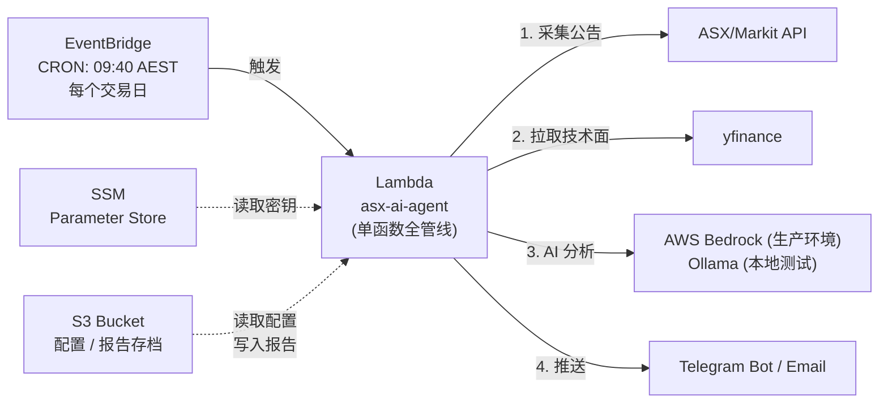
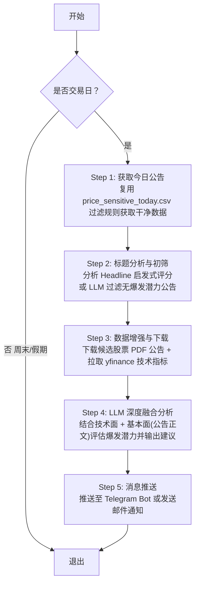

# ASX AI Agent — 每日价敏公告智能分析与推送系统

## 📌 项目概述

部署在 AWS 上的全自动 AI Agent。每个交易日 **开盘前 20 分钟 (09:40 AEST)** 自动运行：

1. 采集 ASX 当日所有 **Price Sensitive** 公告
2. 拉取涉及股票的技术面（RSI、成交量、动量）和基本面（市值、P/E）数据
3. 用 LLM (AWS Bedrock Claude) 分析催化剂质量并评估爆发概率
4. 通过 Telegram Bot 推送「今日 Top 5 最有可能爆发的股票」

### 设计哲学：极简 & 极省

| 原则 | 实现 |
|------|------|
| **一个 Lambda 做所有事** | 不拆分微服务，一个函数跑完全部管线 |
| **S3 存储一切** | 不用 DynamoDB，JSON 文件存 S3（几乎免费） |
| **SSM Parameter Store** | 不用 Secrets Manager（免费 vs $0.40/secret/月） |
| **Terraform 部署** | 一键 `terraform apply` 部署全部基础设施 |
| **月成本 < $2 USD** | Bedrock 按 token 计费是唯一实质成本 |

---

## 🏗️ 1. 系统架构



### 为什么不拆分 Lambda？

| 拆分方案 | 缺点 |
|---------|------|
| 4 个 Lambda + SNS/SQS | 复杂度高、调试困难、额外的事件传递成本 |
| Step Functions 编排 | 每次状态转换 $0.025/千次，此场景过度设计 |
| **单 Lambda** ✅ | 全管线 3-5 分钟跑完，远低于 15 分钟限制 |

---

## 📊 2. 核心管线逻辑 (Pipeline Workflow)

系统核心由单 Lambda 函数（在本地开发调试阶段则为单脚本）串行驱动，具体流程分为以下 5 个核心步骤：



### 📋 5 步详细处理流程

#### Step 1: 公告采集 (获取今日可能重大公告)
* **逻辑设计**：直接复用在 `asx` 目录下产出 `price_sensitive_today.csv` 的成熟代码逻辑。
* **数据来源**：调用 ASX/Markit API 获取当天所有的 `isPriceSensitive == true` 公告。
* **清洗过滤**：自动剔除已知的无效/噪声公告，例如 `Pause in Trading`, `Trading Halt`, `Response to ASX Price Query` 以及例行的董事变动（Appendix 3Y）、治理公开（Appendix 4G）等，确保输出的初始集合是干净且有研究价值的公告。

#### Step 2: 标题初筛 (分析 Headline 过滤备选股)
* **逻辑设计**：由于深度分析 (Deep Dive) 需要拉取数据并下载 PDF 进行大文本读取，因此需要在本步骤进行低成本的初筛以减少 API 调用。
* **评估方法**：
  * **模式 1 (启发式规则)**：分析 Headline 中的强催化剂关键词（如 `maiden resource`, `binding agreement`, `FDA approval`, `takeover bid`）以及高价值动作。
  * **模式 2 (LLM 批量初筛)**：将所有通过 Step 1 清洗后的标题打包发送给 LLM 进行低 Token 评分，返回 `1-5` 分的利好评级。
* **通过阈值**：只有评分评级在 `3分` 及以上的公告，才会进入下一步进行数据增强。

#### Step 3: 数据增强与 PDF 下载 (技术指标 + 公告原文)
* **逻辑设计**：针对 Step 2 筛选出来的潜力股，下载具体公告正文并拉取相关的技术面信息进行指标提取：
  * **公告正文获取**：通过 Markit CDN 链接下载对应的公告 PDF 文件，提取出前 5 页的正文文本（获取具体业务逻辑和核心数据）。
  * **技术指标拉取**：通过 `yfinance` 拉取该股票的历史行情，提取短期关键指标：
    * **RSI (14天)**：判断超买超卖状态，寻找超卖反弹或强势突破股票。
    * **Volume Surge (成交量激增度)**：计算今日/最近成交量对比 20 天平均成交量的暴增幅度，作为资金关注的硬指标。
    * **Momentum (动量)**：多周期价格涨跌幅与均线偏离度。

#### Step 4: LLM 深度分析与建议输出 (技术面 + 基本面融合)
* **逻辑设计**：将获得的**技术面指标**与提取的**公告 PDF 正文文本**组合成复合 Prompt 发送给大模型（如 Bedrock Claude 3.5 Sonnet）。
* **分析维度**：
  * **基本面（公告内容）**：评估公告内容的实质性影响（例如矿品级是否惊艳、合同金额占市值的比例、FDA 审批的排他性等）。
  * **技术面（指标反馈）**：观察是否有资金提前潜伏（成交量激增）、是否存在技术面反弹信号（RSI 触底）或高位涨幅过大风险。
* **输出内容 (JSON 结构化)**：包含爆发概率评级（极高/高/中/低）、深度逻辑摘要、风险提示及具体的操作买卖建议。

#### Step 5: 多渠道推送 (Telegram / 邮件)
* **逻辑设计**：将最终生成的 Top 股票深度分析以精美排版的格式推送给用户。
* **推送通道**：
  * **Telegram Bot**：支持原生 Markdown V2 排版与手机即时推送，极低开发成本，完全免费。
  * **Email (AWS SES / SMTP)**：对于长文阅读或归档需求，支持通过验证的邮箱进行每日报告发送。

---

## 📁 3. 项目结构

```
e:\repos\pythonProjects\AI_Agent\
├── README.md                        # 本文件
│
├── terraform/                       # IaC — 一键部署
│   ├── main.tf                      # Provider + 模块编排
│   ├── variables.tf                 # 输入变量
│   ├── outputs.tf                   # 输出 (Lambda ARN, S3 Bucket 等)
│   ├── lambda.tf                    # Lambda 函数 + Layer + EventBridge
│   ├── storage.tf                   # S3 Bucket
│   ├── iam.tf                      # IAM Role + Policy (最小权限)
│   ├── ssm.tf                      # SSM Parameter Store (密钥)
│   └── terraform.tfvars.example    # 变量示例文件
│
├── src/                             # Lambda 源码
│   ├── handler.py                   # Lambda 入口 — 管线编排
│   ├── collector.py                 # Step 1-2: 公告采集 + 评分
│   ├── enricher.py                  # Step 3-4: 技术面 + 基本面
│   ├── analyst.py                   # Step 5-6: AI 分析 + 融合排名
│   ├── dispatcher.py                # Step 7: Telegram 推送
│   ├── models.py                    # Pydantic 数据模型
│   └── utils.py                     # 工具函数 (HTTP, 时区, PDF)
│
├── config/
│   ├── settings.yaml                # 评分权重、关键词、API 配置
│   └── holidays.yaml                # 澳洲公共假期
│
├── tests/
│   ├── conftest.py                  # Fixtures (mock API, S3)
│   ├── test_collector.py
│   ├── test_enricher.py
│   ├── test_analyst.py
│   ├── test_dispatcher.py
│   └── test_handler.py
│
├── scripts/
│   ├── deploy.sh                    # 打包 + terraform apply
│   └── test_local.py               # 本地模拟运行
│
├── requirements.txt                 # Lambda 运行时依赖
└── requirements-dev.txt             # 开发/测试依赖
```

---

## ⚙️ 4. Terraform 基础设施

### 4.1 资源清单

| 资源 | Terraform Resource | 说明 |
|------|-------------------|------|
| S3 Bucket | `aws_s3_bucket` | 存配置 + 报告存档 |
| Lambda Function | `aws_lambda_function` | 单函数，Python 3.12, ARM64 |
| Lambda Layer | `aws_lambda_layer_version` | 共享依赖 (requests, yfinance, etc.) |
| EventBridge Rule | `aws_cloudwatch_event_rule` | CRON 定时触发 |
| IAM Role + Policy | `aws_iam_role` | Lambda 执行角色（最小权限） |
| SSM Parameters | `aws_ssm_parameter` | Telegram Token、PDF Token |
| CloudWatch Log Group | `aws_cloudwatch_log_group` | 日志，14 天保留 |

### 4.2 核心 Terraform 设计

```hcl
# --- terraform/main.tf ---
terraform {
  required_version = ">= 1.5"
  required_providers {
    aws = {
      source  = "hashicorp/aws"
      version = "~> 5.0"
    }
  }
}

provider "aws" {
  region  = var.aws_region
  profile = var.aws_profile
}
```

```hcl
# --- terraform/lambda.tf ---
resource "aws_lambda_function" "asx_agent" {
  function_name = "asx-ai-agent"
  runtime       = "python3.12"
  handler       = "handler.lambda_handler"
  architectures = ["arm64"]         # Graviton2 — 比 x86 便宜 20%
  memory_size   = 1024              # yfinance + pandas 需要较大内存
  timeout       = 600               # 10 分钟超时（留足余量）

  filename         = data.archive_file.lambda_zip.output_path
  source_code_hash = data.archive_file.lambda_zip.output_base64sha256
  role             = aws_iam_role.lambda_role.arn
  layers           = [aws_lambda_layer_version.deps.arn]

  environment {
    variables = {
      S3_BUCKET         = aws_s3_bucket.agent.id
      AWS_REGION_NAME   = var.aws_region
      BEDROCK_MODEL_ID  = var.bedrock_model_id
      TELEGRAM_TOKEN_SSM = aws_ssm_parameter.telegram_token.name
      PDF_TOKEN_SSM      = aws_ssm_parameter.pdf_token.name
      TELEGRAM_CHAT_ID_SSM = aws_ssm_parameter.telegram_chat_id.name
    }
  }
}

# EventBridge CRON: 09:40 AEST = 23:40 UTC (前一天)
resource "aws_cloudwatch_event_rule" "daily_trigger" {
  name                = "asx-agent-daily"
  schedule_expression = "cron(40 23 ? * SUN-THU *)"  # UTC
  # SUN 23:40 UTC = MON 09:40 AEST ✅
  # THU 23:40 UTC = FRI 09:40 AEST ✅
}

resource "aws_cloudwatch_event_target" "trigger_lambda" {
  rule = aws_cloudwatch_event_rule.daily_trigger.name
  arn  = aws_lambda_function.asx_agent.arn
}

resource "aws_lambda_permission" "allow_eventbridge" {
  statement_id  = "AllowEventBridge"
  action        = "lambda:InvokeFunction"
  function_name = aws_lambda_function.asx_agent.function_name
  principal     = "events.amazonaws.com"
  source_arn    = aws_cloudwatch_event_rule.daily_trigger.arn
}
```

```hcl
# --- terraform/iam.tf ---
resource "aws_iam_role" "lambda_role" {
  name = "asx-ai-agent-role"
  assume_role_policy = jsonencode({
    Version = "2012-10-17"
    Statement = [{
      Action    = "sts:AssumeRole"
      Effect    = "Allow"
      Principal = { Service = "lambda.amazonaws.com" }
    }]
  })
}

resource "aws_iam_role_policy" "lambda_policy" {
  name = "asx-ai-agent-policy"
  role = aws_iam_role.lambda_role.id
  policy = jsonencode({
    Version = "2012-10-17"
    Statement = [
      {
        Effect = "Allow"
        Action = ["logs:CreateLogGroup", "logs:CreateLogStream", "logs:PutLogEvents"]
        Resource = "arn:aws:logs:*:*:*"
      },
      {
        Effect   = "Allow"
        Action   = ["s3:GetObject", "s3:PutObject", "s3:ListBucket"]
        Resource = [
          aws_s3_bucket.agent.arn,
          "${aws_s3_bucket.agent.arn}/*"
        ]
      },
      {
        Effect   = "Allow"
        Action   = ["ssm:GetParameter"]
        Resource = "arn:aws:ssm:${var.aws_region}:*:parameter/asx-agent/*"
      },
      {
        Effect   = "Allow"
        Action   = ["bedrock:InvokeModel"]
        Resource = "arn:aws:bedrock:${var.aws_region}::foundation-model/${var.bedrock_model_id}"
      }
    ]
  })
}
```

```hcl
# --- terraform/variables.tf ---
variable "aws_region" {
  default = "ap-southeast-2"   # Sydney
}

variable "aws_profile" {
  default = "default"
}

variable "bedrock_model_id" {
  default = "anthropic.claude-3-5-sonnet-20241022-v2:0"
}

variable "telegram_bot_token" {
  sensitive = true
  type      = string
}

variable "telegram_chat_id" {
  type = string
}

variable "asx_pdf_token" {
  sensitive = true
  type      = string
  default   = ""
}
```

### 4.3 IAM 权限矩阵

| 权限 | 资源 | 用途 |
|------|------|------|
| `logs:*` | CloudWatch Logs | Lambda 日志 |
| `s3:GetObject/PutObject` | `asx-ai-agent-*` bucket | 配置读取 + 报告写入 |
| `ssm:GetParameter` | `/asx-agent/*` | 读取 Telegram Token 等 |
| `bedrock:InvokeModel` | Claude 3.5 Sonnet | AI 分析 |

---

## 💰 5. 成本分析

### 5.1 月度成本明细

| 服务 | 月用量 | 单价 | 月成本 (USD) |
|------|--------|------|-------------|
| **Lambda** | 22 次 × 5min × 1024MB | $0.0000133/GB-s (ARM) | **$0.01** |
| **S3** | < 10 MB 存储 + 22 次读写 | $0.025/GB + $0.005/千次 | **$0.01** |
| **EventBridge** | 22 事件/月 | 免费 | **$0.00** |
| **SSM Parameter Store** | ~22 GetParameter/月 | Standard 免费 | **$0.00** |
| **CloudWatch Logs** | ~5 MB/月 | $0.50/GB 采集 | **$0.01** |
| **Bedrock Claude 3.5 Sonnet** | ~20K input + 5K output tokens/天 | $3/M input, $15/M output | **$1.80** |
| **总计** | | | **≈ $1.83/月** |

> **对比**: 如果用 DynamoDB ($1/月) + Secrets Manager ($1.20/3个) + 4个Lambda + Step Functions，成本会是 $5-8/月。本设计节省 70%+。

### 5.2 Bedrock Token 估算

```
每日:
  Prompt (input):
    - 系统指令: ~500 tokens
    - 公告数据 (10-20条 × ~200 tokens): ~4000 tokens
    - 技术面数据 (~100 tokens/stock × 20): ~2000 tokens
    - 合计 input: ~6500 tokens/天 → ~$0.02/天

  Response (output):
    - Top 10 分析结果: ~2000 tokens/天 → ~$0.03/天

  合计: ~$0.05/天 × 22交易日 ≈ $1.10/月

  (上方表格按保守上限估算)
```

### 5.3 推送渠道比较 (Telegram vs Email)

| 特性 | Telegram Bot | Email (AWS SES) | 推荐度 |
|------|--------------|-----------------|--------|
| **费用** | **完全免费** | 前 62,000 封/月免费，超出后 $0.10/1000封 | **Telegram 胜出** (真正零成本) |
| **时效性** | 即时通知，手机原生弹窗提醒 | 存在延迟，可能被归类为垃圾或促销邮件 | **Telegram 胜出** |
| **排版体验** | 原生支持 Markdown V2, Emoji, 代码块 | 需编写 HTML/CSS 才能好看 | **Telegram 胜出** (开发成本极低) |
| **基础设施** | 只需在 SSM 存一个 Bot Token | 需在 AWS SES 验证域名/邮箱，申请脱离 Sandbox | **Telegram 胜出** (免验证域名) |
| **未来扩展** | 可实现双向互动 (如发送 `/analyze BHP`) | 仅支持单向推送 | **Telegram 胜出** |

**结论**: 强烈推荐首选 **Telegram Bot**。Email 虽然在 SES 免费额度内也不花钱，但在配置难度（SES Sandbox 限制限制发信额度和需要验证邮箱）以及阅读体验上，远不如 Telegram。

---

## 🗄️ 6. 存储设计 (S3 Only)

```
s3://asx-ai-agent-{account_id}/
├── config/
│   ├── settings.yaml              # 评分权重、关键词
│   ├── holidays.yaml              # 公共假期
│   └── watchlist.yaml             # 可选: 重点关注 Tickers
│
├── reports/
│   └── 2026-05-28/
│       ├── announcements.json     # 原始公告 + 评分
│       ├── market_data.json       # 技术面 + 基本面
│       ├── ai_analysis.json       # LLM 输出
│       └── final_ranking.json     # 融合排名结果
│
└── archive/
    └── alerts/
        └── 2026-05-28.json        # 推送记录
```

**生命周期策略** (Terraform 配置):

```hcl
resource "aws_s3_bucket_lifecycle_configuration" "archive" {
  bucket = aws_s3_bucket.agent.id
  rule {
    id     = "archive-old-reports"
    status = "Enabled"
    filter { prefix = "reports/" }
    transition {
      days          = 30
      storage_class = "GLACIER_IR"    # 30天后转 Glacier
    }
    expiration { days = 180 }         # 180天后删除
  }
}
```

---

## 📐 7. 数据模型 (Pydantic)

```python
# src/models.py

class Announcement(BaseModel):
    ticker: str
    company: str
    headline: str
    summary: str
    date: str                       # YYYY-MM-DD
    rating: int                     # 启发式评分 1-5
    rating_reason: str              # 评分原因 (分号分隔)
    is_price_sensitive: bool
    pdf_url: str | None = None
    pdf_text: str | None = None     # 前5页提取文本

class MarketData(BaseModel):
    ticker: str
    current_price: float
    price_diff_1d: float            # %
    price_diff_5d: float            # %
    rsi: float                      # 14-day RSI
    momentum: float                 # Z-Score
    volatility: float               # %
    volume: int
    volume_surge: float             # % above 20-day avg
    technical_score: float          # 综合动量评分 0-100
    market_cap: float | None = None
    pe: float | None = None
    industry: str | None = None

class AIAnalysis(BaseModel):
    ticker: str
    company: str
    catalyst_score: int             # 1-10
    breakout_probability: str       # 低/中/高/极高
    reasoning: str                  # 120字摘要
    risk_note: str
    action: str                     # 强力买入/买入/观望/卖出

class RankedStock(BaseModel):
    ticker: str
    company: str
    headline: str
    current_price: float
    price_diff_1d: float
    rsi: float
    volume_surge: float
    heuristic_score: float          # 归一化到 0-100
    technical_score: float          # 0-100
    ai_score: float                 # 归一化到 0-100
    final_score: float              # 加权融合
    breakout_probability: str
    reasoning: str
    risk_note: str
    action: str
```

---

## 🚀 8. 部署流程

### 8.1 前置条件

```bash
# 1. 安装 Terraform
choco install terraform        # Windows
# brew install terraform       # macOS

# 2. 配置 AWS CLI
aws configure --profile asx-agent

# 3. 确认 Bedrock Claude 模型已在 ap-southeast-2 开启
#    AWS Console → Bedrock → Model Access → 勾选 Claude 3.5 Sonnet
```

### 8.2 首次部署

```bash
cd e:\repos\pythonProjects\AI_Agent

# 1. 安装 Python 依赖 (本地开发)
pip install -r requirements-dev.txt

# 2. 运行测试
pytest tests/ -v

# 3. 打包 Lambda Layer + 源码
bash scripts/deploy.sh build

# 4. Terraform 初始化 + 部署
cd terraform
terraform init
terraform plan -var="telegram_bot_token=YOUR_TOKEN" -var="telegram_chat_id=YOUR_CHAT_ID"
terraform apply -var="telegram_bot_token=YOUR_TOKEN" -var="telegram_chat_id=YOUR_CHAT_ID"
```

### 8.3 更新代码

```bash
# 重新打包并更新 Lambda
bash scripts/deploy.sh update
cd terraform && terraform apply
```

### 8.4 手动触发测试

```bash
# 在 AWS Console 或 CLI 手动触发 Lambda
aws lambda invoke --function-name asx-ai-agent --payload '{}' output.json --profile asx-agent
cat output.json
```

### 8.5 本地测试（使用 Ollama 零成本调试）

我们支持在部署到 AWS 前，完全在本地机器上运行端到端测试。你可以配置代码使用本地的 **Ollama** 替代 AWS Bedrock，从而实现零成本开发。

```bash
# 1. 确保 Ollama 已在本地运行，并拉取了模型（例如 llama3.1 或 qwen2.5）
ollama run llama3.1

# 2. 设置环境变量，切换为本地 LLM
export LLM_PROVIDER="ollama"
export OLLAMA_HOST="http://localhost:11434"
export OLLAMA_MODEL="llama3.1"

# 3. 模拟运行 — 仅采集 + 评分 + 打印，不调用 LLM 也不推送
python scripts/test_local.py --dry-run

# 4. 完整模拟（使用 Ollama 分析，并打印推送结果）
python scripts/test_local.py --full
```

---

## 🔧 9. 配置文件

### `config/settings.yaml`

```yaml
agent:
  version: "1.0.0"
  timezone: "Australia/Sydney"
  trigger_time: "09:40"              # AEST, 开盘前20分钟
  top_n: 5                           # 推送 Top N 只股票

# ASX API
api:
  announcements_base: "https://asx.api.markitdigital.com/asx-research/1.0/markets/announcements"
  company_header: "https://asx.api.markitdigital.com/asx-research/1.0/companies/{}/header"
  company_stats: "https://asx.api.markitdigital.com/asx-research/1.0/companies/{}/key-statistics"
  items_per_page: 500
  rate_limit_seconds: 0.3

# LLM 标题初筛 (Triage) & 兜底关键词
triage:
  llm_model: "anthropic.claude-3-5-sonnet-20241022-v2:0" # 初筛也用大模型，能力更强
  min_pass_score: 3

  # 兜底规则：如果 LLM 幻觉没选上这些，强制将评分改为 5
  fallback_strong_phrases:
    - "maiden resource estimate"
    - "definitive feasibility study"
    - "binding agreement"
    - "takeover bid"
    - "fda approval"

  # 需要过滤的绝对噪音 (预处理，甚至不发给 LLM 浪费 token)
  noise_keywords:
    - "appendix 4g"
    - "appendix 3y"
    - "change of director"
    - "becoming a substantial holder"
    - "ceasing to be"
    - "notice of meeting"
    - "proxy form"

# 技术面分析
analyzer:
  history_period: "6mo"
  rsi_period: 14
  volume_surge_threshold: 50
  min_market_cap: 15000000

# AI 分析
ai:
  model_id: "anthropic.claude-3-5-sonnet-20241022-v2:0"
  max_tokens: 4096
  temperature: 0.3
  pre_filter_min_rating: 3

# 排名权重
scoring:
  technical_weight: 0.40
  ai_weight: 0.60

# 推送
telegram:
  parse_mode: "Markdown"
  disable_web_page_preview: true

# S3 报告存档
storage:
  reports_prefix: "reports"
  archive_prefix: "archive/alerts"
```

### `config/holidays.yaml`

```yaml
# ASX 2026 公共假期 — 不触发采集
holidays:
  - "2026-01-01"   # New Year's Day
  - "2026-01-27"   # Australia Day
  - "2026-04-03"   # Good Friday
  - "2026-04-06"   # Easter Monday
  - "2026-04-25"   # ANZAC Day
  - "2026-06-08"   # Queen's Birthday (NSW)
  - "2026-12-25"   # Christmas Day
  - "2026-12-28"   # Boxing Day (observed)
```

---

## 🧪 10. 测试策略

| 测试类型 | 文件 | 方法 |
|---------|------|------|
| **评分引擎** | `test_collector.py` | 纯函数测试，无外部依赖 |
| **技术指标** | `test_enricher.py` | Mock yfinance 数据，验证 RSI/Score 计算 |
| **AI Prompt** | `test_analyst.py` | 验证 Prompt 构建 + JSON 解析 |
| **Telegram 格式** | `test_dispatcher.py` | 验证消息格式化 |
| **端到端** | `test_handler.py` | Mock 全部外部 API，验证管线流转 |
| **Prompt 回测** | `scripts/backtest.py` | 用历史数据评估 LLM 输出质量 |

```bash
# 运行全部测试
pytest tests/ -v

# 仅评分引擎
pytest tests/test_collector.py -v

# 本地集成测试（连接真实 ASX API，不推送）
pytest tests/ -v -m integration --dry-run
```

---

## 🗓️ 11. 开发路线图

### Phase 1 — MVP (1-2 周)
- [ ] Terraform IaC (S3 + Lambda + EventBridge + IAM + SSM)
- [ ] `collector.py` — 公告采集 + 启发式评分
- [ ] `enricher.py` — 技术面 + 基本面数据拉取
- [ ] `analyst.py` — Bedrock Claude 分析
- [ ] `dispatcher.py` — Telegram 推送
- [ ] `handler.py` — 管线编排
- [ ] `deploy.sh` — 打包 + 部署脚本
- [ ] 基础测试套件

### Phase 2 — 打磨 (第 3 周)
- [ ] Prompt 调优（用历史数据 A/B 测试）
- [ ] PDF 文本提取（评分高的公告提取 PDF 送入 LLM）
- [ ] 推送去重（同一 Ticker 7 天内不重复推送）
- [ ] 澳洲假期自动跳过

### Phase 3 — 高级功能 (未来)
- [ ] 收盘后自动回测：对比推送 vs 实际涨跌
- [ ] 自适应权重：根据命中率调整 w1/w2/w3
- [ ] 可选: 微信推送渠道
- [ ] 可选: S3 静态页面展示历史推送

---

## 💡 12. 关键设计决策

| 决策 | 选择 | 理由 |
|------|------|------|
| IaC | **Terraform** | 用户指定；跨云可移植；.tf 文件可直接 `apply` |
| 计算 | **单 Lambda** | 全管线 < 10 分钟；避免微服务复杂度；成本最低 |
| 存储 | **纯 S3** | JSON 文件足够；$0.01/月 vs DynamoDB $1+/月 |
| 密钥 | **SSM Parameter Store** | 免费 vs Secrets Manager $0.40/secret/月 |
| AI | **Bedrock Claude** | 同 AWS 生态；IAM 认证；无需管理 API Key |
| 推送 | **Telegram** | 实时、免费、支持 Markdown 格式 |
| 架构 | **ARM64 (Graviton)** | 比 x86 便宜 20%，性能相当 |
| 日志 | **CloudWatch 14天保留** | 免费额度内；超出部分 $0.50/GB |
| CRON 时区 | **UTC → AEST 换算** | EventBridge 仅支持 UTC CRON |
