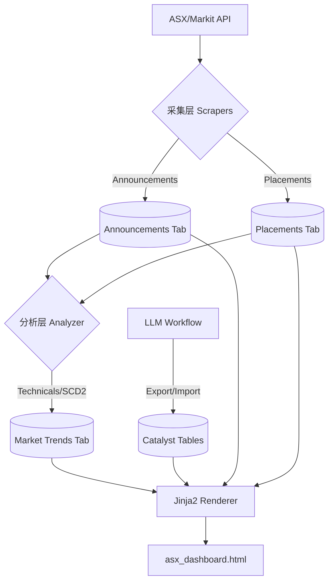

# ASX 投研仪表盘与自动化管线 (ASX Research Dashboard & Automation) `v1.4 - Tech Spec`

这是一个完全解耦的自动化投研数据管线。本文件作为系统的 **唯一事实来源 (Source of Truth)**，详细记录了所有模块的核心逻辑与架构算法，旨在使开发者能够基于此文档重构整个系统。

---

## 🏗️ 1. 全局架构与设计哲学

系统设计核心：**数据源动态化、存储解耦化、UI 静态化**。

### 1.1 数据流向 (Data Flow)


### 1.2 全解耦存储 (Total Decoupling)
- **无外键约束**: 数据库 `stocks`, `announcements`, `placements` 等表之间不建立物理外键。
- **关联逻辑**: 统一通过 `symbol` (Ticker) 在应用层进行 `JOIN`。
- **目的**: 防止级联删除风险，确保即便主表 Stock 被删除，历史研究快照依然可查。

---

## 🛠️ 2. 模块逻辑解析 (Reconstruction Guide)

### 2.1 基础架构与连接 (`db_manager.py` & `db_models.py`)
- **连接管理**: 使用 SQLAlchemy 的 `scoped_session` 实现线程安全的单例连接池。
- **自动初始化**: `init_db()` 会检查 `asx` schema 是否存在，若不存在则创建 schema 并根据 `db_models.py` 自动反射（Metadata.create_all）所有表定义。
- **事务控制**: 使用 `@contextmanager` 封装 `session_scope`，实现异常自动 Rollback 与资源自动回收。
- **数据验证**: `db_schemas.py` 提供 Pydantic V2 模型用于入库前校验（如 `StockSchema`, `CatalystSchema`, `PlacementSchema`）。

### 2.2 公告采集与评级 (`asx_announcements.py`)
- **增量续传算法**: 
    1. 查询数据库中最新的 `event_date`。
    2. 若存在且未开启 `--full-refresh`，则将抓取起始日设为该日期（Resumption）。
    3. 若不存在，则回退至命令行指定的 `--months`（默认 1 个月）。
- **启发式评分引擎 (Rating Engine 1-5)**:
    - **Base**: 默认 1 分（常规行政/公告）。
    - **+2 分 (API Signal)**: 匹配 API 端的 `isPriceSensitive` 真值标志。
    - **+2 分 (High Value)**: 匹配 "assay", "drilling", "results", "high-grade", "maiden", "resource", "approval" 等核心发现词。
    - **+1 分 (Mid Value)**: 匹配 "trading halt", "placement", "quarterly", "half year", "guidance" 等运营/资金融通词。
    - **Summary 逻辑**: 自动从 `announcementTypes` 列表聚合而成（如 "Trading Halt, Market Sensitive"）。
- **公司名解析 (3-Tier Fallback)**:
    1. 优先使用 API 的 `companyInfo.displayName`。
    2. 若 API 为空，则实时匹配本地 `stocks` 表中的 `name` 字段。
    3. 极端情况下回退到 Symbol 原文。
- **Rate Limiting**: API 分页请求之间强制 `time.sleep(0.3)`。
- **时区标准化**: 所有时间戳统一转为 `Australia/Sydney` 时区（通过 `get_sydney_time()`），确保公告日期与交易日一致。

### 2.3 融资增发监测 (`asx_placements.py`)
- **Filter-First Pipeline（先过滤，后提取）**: 
    1. **Phase 1 - 监控列表门控**: 排除不在 `stocks` 表中的股票。
    2. **Phase 2 - 批量获取市场数据**: 使用 `ThreadPoolExecutor(max_workers=20)` 并行获取合格股票的价格/市值。
    3. **Phase 3 - 流动性门控**: 市值低于 **$15,000,000 AUD** (`DEFAULT_MCAP_FILTER`) 的股票被过滤。
    4. **Phase 4 - CR价格提取**: 仅对通过门控的股票执行标题正则解析→PDF下载→内容提取。
- **正则价格提取 (`extract_cr_price`)**:
    - `pattern_1`: `@ \$?(\d+\.\d+)`
    - `pattern_2`: `at \$?(\d+\.\d+)`
    - `pattern_3`: `\$?(\d+\.\d+) per share`
    - **精度**: 支持最多 4 位小数 (如 $0.7625)。
- **并发刷新与名录回填**: 
    - **自动补全**: 若融资记录缺少 `company` 字段，会在刷新市价时自动从 Markit API 增量提取并回填名称。

### 2.4 动能分析与评分 (`asx_analyzer.py`)
- **技术指标定义**:
    - **RSI**: 14 日均线计算。
    - **Momentum**: `(当前价 - 周期均价) / 标准差` (Z-Score 变体)。
    - **Volatility**: 日收益率的标准差百分比。
- **综合权重评分 (Proprietary Score)**:
    - **Base**: 50.0。
    - **修正**: 
        - RSI < 30: +10 分；RSI > 70: -5 分。
        - 动量修正：`momentum * 5`。
        - 价格激增：`1d_diff * 2 + 5d_diff * 1.5`。
        - 成交量激增：`Vol_Change > 50%` 时 +5 分。
    - **Range**: 强制限制在 [0, 100] 区间。

### 2.5 催化剂评级系统 (`asx_catalysts.py`)
- **五级评级**: `强力买入` > `买入` > `观望` > `卖出` > `强力卖出`。
- **排序优先级**: Rating Score → Breakout Probability → CR Risk → Ticker Name。
- **Dashboard 展示**: 评级以颜色徽章呈现（绿→灰→红渐变）。

### 2.6 缓慢变化维 (SCD Type 2) 逻辑实现
在 `market_trends` 和 `catalyst_items` 中应用：
1. **同步时**: 找出 `symbol` 对应且 `is_active=True` 的记录。
2. **比较**: 若内容发生显著变化，则将旧记录 `is_active` 置为 `False`，设置 `valid_to` 为当前时间。
3. **新增**: 插入新记录，`is_active=True`, `valid_from=Now`。

---

## 💡 3. LLM 协作工作流详解 (`llm_workflow.py`)

系统并非简单的文件覆盖，而是实现了 **Segment-Level Sync (分节同步)**：

- **Export**: 根据 `symbol` 将 `CatalystMaster`（静态属性，含 Rating）与 `CatalystItem`（动态条目）聚合为一个 Pydantic 模型，输出 YAML。
- **Import**:
    - **Master 更新**: 直接更新 `rating`, `cr_risk`, `probability` 及其 `reason` 字段。
    - **Item 智能识别**: 
        - 读取 YAML 中的 `Catalysts`, `Risks`, `Timeline` 数组。
        - 将其与数据库中的内容进行布隆过滤器式的比对。
        - **新条目**: 插入。
        - **消失的条目**: 软删除（退役）。
        - **存在的条目**: 维持现状。

---

## 🧰 4. 辅助工具脚本

| 脚本 | 用途 | 类型 |
|------|------|------|
| `add_stock.py` | 手动添加新股票到 DB 并初始化 CatalystMaster | CLI 工具 |
| `reseed_asx.py` | 从 YAML 完整重建整个 `asx` schema | 恢复工具 |

---

## 📑 5. 数据字典与 ID 生成

- **`unique_key` 生成公式**: `ASXCode_Date_Headline[:100]`。用于保证采集层（Announcements）的幂等性，防止重复插入。
- **`price_history` 存储**: 逗号分隔的字符串（最近 10 次价格），减少 JSONB 膨胀，加速 Sparkline 生成。
- **CR_Price 精度**: Float 类型，支持最多 4 位小数显示。

---

## 🏁 6. 开发与重构指令

### 6.1 环境初始化
```bash
# 1. 复制环境
cp .env.example .env

# 2. 数据库重建 (幂等)
python run.py reseed
```

### 6.2 核心运行命令映射
- `run.py all`: 顺序调用 `asx_announcements -> asx_placements -> asx_analyzer -> asx_catalysts -> build_dashboard`。
- `run.py llm-export --ticker <T>`: 调用 `llm_workflow.py export <T>`。
- `run.py dashboard`: 仅重建 Dashboard HTML。

---

## 🧪 7. 测试与验证规范

修改后必须运行以下测试以确保逻辑闭环 (遵循 **"一脚本一测试"** 原则)：

```bash
pytest tests/ -v
```

| 测试文件 | 覆盖模块 | 关键验证项 |
|----------|----------|------------|
| `test_asx_announcements.py` | `asx_announcements.py` | Rating 启发式、Summary 提取、唯一键幂等性、增量续传、时区感知 |
| `test_asx_placements.py` | `asx_placements.py` | CR价格正则提取、市价同步、名录回填、**Filter-First Pipeline（监控列表/市值门控）** |
| `test_asx_analyzer.py` | `asx_analyzer.py` | 动量评分 (Z-Score) 及评分边界 |
| `test_asx_catalysts.py` | `asx_catalysts.py` | 催化剂导出、字段有效性、**Rating Schema 默认值/排序逻辑** |
| `test_db_manager.py` | `db_manager.py` | 数据库连接、解耦架构及数据完整性 |
| `test_utils.py` | `utils.py` | 通用工具函数、日期格式化、Sparkline 生成、**Sydney 时区转换** |
| `test_run.py` | `run.py` | 主运行逻辑、Dashboard 渲染及前端展示逻辑 |

**警告**: 任何对 `db_models.py` 的修改必须运行 `reseed` 校验，并确保 `scripts/db_schemas.py` 同步更新。
