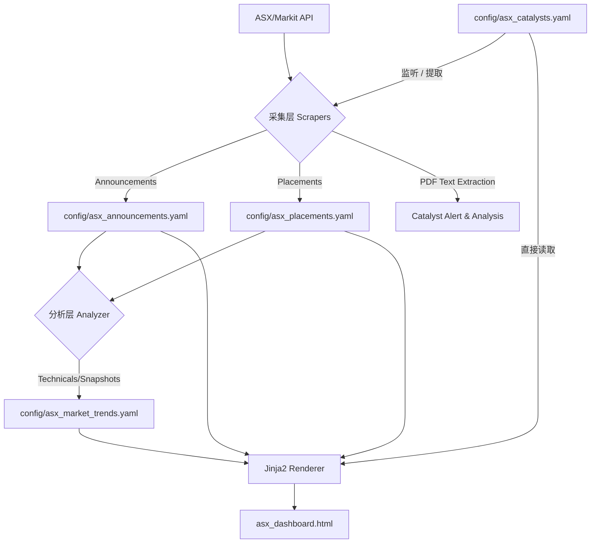

# ASX 投研仪表盘与自动化管线 (ASX Research Dashboard & Automation) `v1.6 - Tech Spec`

这是一个完全解耦的自动化投研数据管线。本文件作为系统的 **唯一事实来源 (Source of Truth)**，详细记录了所有模块的核心逻辑与架构算法，旨在使开发者能够基于此文档重构整个系统。

---

## 🏗️ 1. 全局架构与设计哲学

系统设计核心：**数据源动态化、存储解耦化、UI 静态化**。

### 1.1 数据流向 (Data Flow)


**核心原则**: 
1. `config/asx_catalysts.yaml` 是催化剂数据的唯一源头。
2. **完整性优先**: 运行前执行 `pytest` 校验，确保 Model、Schema、UI、Doc 四位一体对齐。
3. **周末智慧跳过**: 周末且数据最新时，自动跳过采集与分析，仅同步配置并渲染 UI。

### 1.2 纯 YAML 扁平化存储 (Pure YAML Architecture)
- **无数据库依赖**: 系统彻底抛弃 SQL 数据库，所有数据以原生 YAML 形式保存。
- **关联逻辑**: 统一通过 `symbol` (Ticker) 在应用层进行匹配合并。
- **高性能缓存**: `asx_analyzer.py` 具备 15 分钟缓存机制，避免频繁请求 API。
- **最新优先策略**: 公告数据仅保留最新交易日的记录，避免 YAML 文件无限增长。
- **目的**: 降低维护成本，实现数据的开箱即用与 Git 版本追踪。

---

## 🛠️ 2. 模块逻辑解析 (Reconstruction Guide)

### 2.1 基础架构与配置 (`utils.py`)
- **配置驱动**: 系统核心参数均从 `config/settings.yaml` 读取，包括 API、并发控制、评分权重等。
- **数据验证**: 使用 Pydantic V2 模型在内存中完成保存前校验，确保 YAML 格式严谨。
- **HTTP 优化**: 统一使用带重试机制的 `requests.Session`，并配置了针对 Markit API 的专用 Header。
- **PDF 文本提取**: 集成 `pdfplumber` 工具，支持对本地缓存的 PDF 进行多页文本提取 (`extract_pdf_text`)，用于智能化分析。

### 2.2 公告采集与评级 (`asx_announcements.py`)
- **最新交易日同步**: 
    1. 抓取起始日设为 YAML 中最新的 `Date` 或命令行指定的 `--months`。
    2. **过滤策略**: 仅处理并保存抓取结果中 **日期最新** 的公告。
    3. **覆盖逻辑**: 每次运行会清除旧的公告记录，仅保留该最新日期的完整公告集。
- **规则配置化**: 关键词、噪音过滤、强短语、分值参数现统一从 `config/settings.yaml -> announcement_rating` 读取。
- **启发式评分引擎 (Rating Engine 1-5)**:
    - **Base**: 默认 1 分（常规行政/公告）。
    - **+1 分 (API Signal)**: 匹配 API 端的 `isPriceSensitive` 标志。
    - **+1 分 (Data Impact)**: 正则匹配数据型关键指标，如 `150g/t`、`2.5%` 等品位/百分比数据。
    - **+1 分 (Dollar Amount)**: 正则匹配金额描述，如 `$15m`、`$100 million`、`A$50m` 等融资/交易规模。
    - **+3 分 (Strong Phrases)**: 标题/摘要匹配 "high-grade assay results", "maiden resource", "dfs results", "fda approval", "binding agreement" 等核心利好短语。
    - **+3 分 (Major Deals)**: 正则匹配 "[Global/Major/Transformational/Landmark] ... [Deal/Contract/Agreement/Partnership]" 等重磅商业合作，强行突破进度报告封顶。
    - **+2 分 (High Value Keywords)**: 匹配 "assay", "drilling", "high-grade", "discovery", "resource", "acquisition", "merger", "takeover" 等核心关键词。
    - **+1 分 (Mid Value Keywords)**: 匹配 "trading halt", "placement", "quarterly", "guidance", "revenue", "contract", "operational" 等运营词。
    - **注意**: Strong / High / Mid 三类为互斥 (`elif`)，仅取命中的最高档。Data Impact 和 Dollar Amount 为独立加分项，可与短语/关键词叠加。
    - **特殊逻辑**:
        - **全大写锁定**: 若标题为全大写（且含字母数 > 10），系统视为极其重大突发，强制判定为 **5 分**（如 `NEW BANKING FACILITY`）。
        - **进展封顶 (Progress Cap)**: 标题含 "progress report" 或 "exploration update" 且未触发 Strong Phrases / Major Deals 时，最高封顶 **4 分**。
    - **Summary 逻辑**: 自动从 `announcementTypes` 列表聚合而成（如 "Trading Halt, Market Sensitive"）。
- **公司名解析 (3-Tier Fallback)**:
    1. 优先使用 API 的 `companyInfo.displayName`。
    2. 若 API 为空，则回退到 Symbol 原文。
- **Rate Limiting**: API 分页请求之间强制 `time.sleep(0.3)`。
- **时区标准化**: 所有时间戳统一转为 `Australia/Sydney` 时区（通过 `get_sydney_time()`），确保公告日期与交易日一致。
- **证券类型与长度过滤 (Security Type Guard)**:
    - **自动黑名单**: 过滤掉常见的非股票缩写（如 `SPP`, `DIV`, `DRP`, `CR`）。
    - **Issue Type 验证 (严格准入)**: 仅放行 `CS` (普通股)、`CD` (存托凭证)、`ET/UI` (ETF和信托单位)。
    - **防御性拦截**: 如果 API 无法识别 Ticker (返回 400/Symbol Not Found)，系统将拦截该 Ticker，防止错误数据混入。
    - **Ticker 长度校验**: 强制限制 Ticker 长度 ≤ 4，自动剔除带字母后缀的衍生品。
- **催化剂联动与智能化预警 (Catalyst Alert)**:
    1. **监听机制**: 脚本自动加载 `asx_catalysts.yaml` 中的 Ticker 观察名单。
    2. **深度触发**: 若名单内的公司发布 **Price Sensitive** 公告，自动下载 PDF。
    3. **文本透传**: 使用 `pdfplumber` 提取前 5 页文本并在终端显示 `CATALYST ALERT` 区块，支持人工/AI 进行即时总结。

### 2.3 融资增发监测 (`asx_placements.py`)
- **Filter-First Pipeline（先过滤，后提取）**: 
    1. **Phase 1 - Override 门控**: 应用 `placement_overrides.yaml` 中的 `delete` / `exclude` 规则，匹配到的 symbol 直接从本地数据中排除。
    2. **Phase 2 - 批量获取市场数据**: 使用并行获取合格股票的价格/市值。
    3. **Phase 3 - 流动性 & 证券类型门控**: 市值低于 **$15,000,000 AUD** 的股票被过滤；同时执行 issueType 白名单、Ticker 长度校验。
    4. **Phase 4 - CR价格提取**: 仅对通过门控的股票执行标题正则解析→PDF下载→内容提取。
- **规则配置化**: headline 关键词、补充正则、分页大小现统一从 `config/settings.yaml -> placements / scanners` 读取。
- **正则价格提取 (`extract_cr_price`) — 3-Tier Cascade & Content Flag**:
    - **Tier 1 — Cents Patterns** (优先): 匹配 `15c`, `15 cents`, `15.5cps` 等，自动 `/100` 转为 dollar。
    - **Tier 2 — Dollar Patterns**: 匹配 `at $0.15`, `priced at $1.50 per share`, `issue price: $0.045` 等。
    - **Tier 3 — Fallback**: 宽松 `$X.XX` 匹配，带 negative lookahead 排除 `$5m` 等总金额。仅在处理标题/短摘要时生效。
- **并发刷新与名录回填**: 
    - **自动补全**: 若融资记录缺少 `company` 字段，会在刷新市价时自动从 Markit API 增量提取并回填名称。
- **证券类型过滤 (Security Type Guard)**:
    - 与公告爬虫一致，仅允许 `CS`, `CD`, `ET`, `UI` 类型。

### 2.4 动能分析与评分 (`asx_analyzer.py`)
- **技术指标定义**:
    *   **RSI (14-Day)**: 使用 **Wilder's Smoothing (维尔德平滑法)** 计算，并抓取 **6 个月** 历史数据以确保算法收敛。
    *   **Volume**: 记录最新交易日的成交量。
    *   **Momentum**: `(当前价 - 周期均价) / 标准差` (Z-Score 变体)。
    *   **Volatility**: 日收益率的标准差百分比。
- **15 分钟缓存与覆盖机制**: 
    - 若 `asx_market_trends.yaml` 更新在 15 分钟内则跳过实时抓取。
    - 每次成功运行会 **重写 (Overwrite)** 该文件，仅保留当前关注名单的最新快照。
- **综合权重评分 (Proprietary Score)**:
    - **Base**: 50.0。
    - **修正**: 基于 RSI 边界、动量 Z-Score、价格波动率及成交量激增幅度进行加权。

### 2.5 催化剂评级系统
- **数据源**: `config/asx_catalysts.yaml`（唯一源头，人工维护 + Git 版本控制）。
- **Dashboard 渲染**: `run.py` 整合所有 YAML 数据进行渲染，支持跨平台同步。
- **五级评级**: `强力买入` > `买入` > `观望` > `卖出` > `强力卖出`。
- **自动评级矩阵 (BP × CR)**: 基于突破概率 (BP) 与 融资风险 (CR) 的差值自动生成默认评级。

---

## 📋 3. 数据规范与配置审查

### 3.1 YAML 数据规范 (`config/asx_catalysts.yaml`)

YAML 是催化剂数据的 **唯一事实来源**。

#### 3.1.1 字段格式定义 (Format Definition)

| 字段 | 类型 | 说明 |
|------|------|------|
| `Ticker`* | `str` | ASX ticker（不含 `.AX`） |
| `Stage` | `str` | 生命周期阶段 (1-5阶) |
| `Company`* | `str` | 公司全名 |
| `Sector` | `str` | 行业/赛道描述 |
| `Catalysts` | `list[str]` | 未来预期事件/催化剂 |
| `Risks` | `list[str]` | 风险列表 |
| `CR_Risk`* | `str` | 融资风险等级 (`极低` 至 `高`) |
| `CR_Risk_Reason` | `str` | 融资风险原因 |
| `Breakout_Probability`* | `str` | 突破概率 (`低` 至 `极高`) |
| `Breakout_Probability_Reason` | `str` | 突破概率原因 |
| `Core_Notes`* | `str` | 核心基本面叙事摘要 |
| `Rating` | `str` | 评级（手填优先，否则根据 BP/CR 自动推导） |
| `Timeline` | `list` | 已发生事件，需精确 `YYYY-MM-DD` |

### 3.2 `config/` 目录用途审查

| 文件 | 用途 |
|------|------|
| `settings.yaml` | API、并发、评分规则及 **自选股名单 (growth/foundation/etf)** |
| `asx_catalysts.yaml` | **主数据源**：Catalyst Radar 的唯一事实来源 |
| `placement_overrides.yaml` | 融资爬虫的手工覆盖 / 排除规则 |
| `asx_announcements.yaml` | 公告数据落地文件（仅保留最新日） |
| `asx_placements.yaml` | 融资数据落地文件 |
| `asx_market_trends.yaml` | 最新技术面快照 |

#### 3.2.1 数据完整性约束
系统依赖 `scripts/schemas.py` 中的 Pydantic 模型进行强制校验。任何字段变更必须同步更新 Schema，否则管线将拒绝保存 YAML。

---

## 📑 4. 数据标识与缓存
- **`unique_key` 生成公式**: `ASXCode_Date_Headline[:100]`。用于保证幂等性。
- **`price_history` 存储**: 逗号分隔的字符串（最近 10 次价格），减少 YAML 文件体积，加速 Sparkline 生成。
- **PDF 缓存**: `.pdf_cache` 仅保留最新交易日所需的 PDF，由 `run.py` 自动清理陈旧文件。

---

## 🧪 5. 测试与验证规范

修改后必须运行以下测试以确保逻辑闭环：

```bash
python -m ruff check scripts tests run.py
pytest tests/ -v
```

| 测试文件 | 关键验证项 |
|----------|------------|
| `test_system_integrity.py` | **版本一致性 (README vs UI)**、README 技术指标同步校验 |
| `test_asx_announcements.py` | Rating 启发式、唯一键幂等性、最新日同步逻辑 |
| `test_asx_placements.py` | CR价格正则提取、市价同步、市值门控 |
| `test_asx_analyzer.py` | 动量评分 (Z-Score) 及 RSI Wilder 平滑校验 |
| `test_utils.py` | 通用工具、日期格式化、Sparkline 生成 |
| `test_run.py` | 主运行逻辑、Dashboard 渲染数据流、催化剂字段校验 |
| `test_dashboard_fields.py` | UI 字段命名一致性、全局搜索注册校验 |

---

## 📊 6. Dashboard 字段命名规范

| 标准字段名 | 数据字段 | 说明 |
|-----------|---------|------|
| `Ticker` | `symbol`, `ASX_Code`, `Ticker` | 股票代码 |
| `Company` | `name`, `Company` | 公司名称 |
| `Date` | `Date`, `event_date` | 日期 |
| `Price` | `current_price`, `Current_Price` | 当前股价 |
| `1D %` | `price_diff_1d`, `Price_Diff_1d` | 1日涨跌幅 |
| `Rating` | `Rating` | 评分/评级 |
| `PDF` | `PDF_Link` | PDF 链接 |
| `Diff %` | `Price_Diff_%` | 相对 CR 价格涨跌幅 |

**版本对齐**: 系统强制执行三位一体版本号 (v1.6) 对齐：`README.md`、`templates/asx_dashboard.html` 与 `test_system_integrity.py`。
执行。

常用命令：

```bash
# 检查整个项目核心 Python 代码
python -m ruff check scripts tests run.py

# 自动修复可安全修复的问题
python -m ruff check scripts tests run.py --fix

# 统一格式化
python -m ruff format scripts tests run.py

# 启用提交前自动检查
pre-commit install

# 手动运行一次 pre-commit
pre-commit run --all-files
```

如果你只想检查单个脚本，可执行：

```bash
python -m ruff check scripts/asx_announcements.py
```

### 6.2 核心运行逻辑与编排
`run.py` 充当管线指挥官，具备以下高级特性：

1. **🛡️ 完整性检查 (Integrity Guard)**: 在执行 `all` 或 `analyze` 前，强制运行测试套件。若 README 文档滞后或字段不匹配，系统将拒绝执行并报警。
2. **🛌 周末智慧跳过 (Weekend Smart Skip)**: 
   - 自动检测悉尼时间是否为周末。
   - 检查最新记录是否已达到周五（最新交易日）。
   - 满足条件时跳过抓取与技术分析，仅执行渲染，极大节省计算资源。
3. **🧹 自动缓存清理 (Automatic Cache Hygiene)**:
   - 每次 `run.py` 命令结束后，自动清理开发缓存目录：`__pycache__`, `.pytest_cache`, `.ruff_cache`, `.mypy_cache`, `.hypothesis`。
   - 同时删除遗留的 `*.pyc` / `*.pyo` 文件。
   - `.pdf_cache` 不会被整目录删除；系统会保留**最新交易日**需要的公告 PDF，并清掉旧 PDF 与无法识别命名的缓存文件。
4. **🌈 彩色化编排**: 使用 ANSI 颜色方案输出日志，区分各模块状态（Cyan 为路径，Green 为成功，Yellow 为警告，Red 为错误）。

### 6.3 运行命令映射
| 命令 | 用途 |
|------|------|
| `run.py all` | 顺序执行 scrape -> analyze -> build_dashboard |
| `run.py scrape` | 仅执行公告与融资数据抓取 |
| `run.py analyze` | 仅执行技术指标计算与评分 |
| `run.py dashboard` | 仅执行 HTML 渲染 |

### 6.4 版本一致性规范
系统强制执行三位一体版本号 (v1.6) 对齐。版本号必须在以下位置保持一致，否则 Integrity Test 将报错：
- `README.md` (标题)
- `templates/asx_dashboard.html` (Title & Header Pill)
- `tests/test_system_integrity.py` (自动化提取并比对)
- `tests/test_dashboard_fields.py` (跨 Tab 字段命名一致性)

### 6.5 数据完整性规范 (Data Integrity Standards)
为确保投研管线的数据纯净，系统强制执行以下准则：
- **禁止幽灵代码**: 严禁注册 API 无法识别的 Ticker（即 Header API 返回 400/Not Found 的 Ticker）。
- **股票唯一性**: `Placement` 文件中的 Ticker 必须在 `Stock` 名单中存在，且代码长度不得超过 4 位。
- **自动拦截机制**: 任何非 `CS`, `CD`, `ET`, `UI` 类型的证券在发现阶段即被物理拦截。

---

## 🧪 7. 测试与验证规范

修改后必须运行以下测试以确保逻辑闭环 (遵循 **"一脚本一测试"** 原则)：

```bash
python -m ruff check scripts tests run.py
pytest tests/ -v
```

| 测试文件 | 覆盖模块 | 关键验证项 |
|----------|----------|------------|
| `test_system_integrity.py` | 全链路 | **版本一致性 (README vs UI)**、README 指标更新校验 |
| `test_asx_announcements.py` | `asx_announcements.py` | Rating 启发式、Summary 提取、唯一键幂等性、增量续传、时区感知 |
| `test_asx_placements.py` | `asx_placements.py` | CR价格正则提取、市价同步、名录回填、**Filter-First Pipeline（监控列表/市值门控）** |
| `test_asx_analyzer.py` | `asx_analyzer.py` | 动量评分 (Z-Score) 及评分边界 |
| `test_utils.py` | `utils.py` | 通用工具函数、日期格式化、Sparkline 生成、**Sydney 时区转换** |
| `test_run.py` | `run.py` | 主运行逻辑、Dashboard 渲染、**YAML 直读催化剂排序/默认值**、催化剂字段有效性 |
| `test_dashboard_fields.py` | `asx_dashboard.html` | 跨 Tab 字段命名一致性、标准化字段验证、**Dashboard 模板渲染 smoke test**、Catalyst Rating 排序 key 校验、**globalSearch 对所有 `.catalyst-table` 的注册与过滤覆盖** |

当前测试目录按职责划分为：

- **采集层**：`test_asx_announcements.py`, `test_asx_placements.py`
- **分析/运行层**：`test_asx_analyzer.py`, `test_run.py`, `test_utils.py`
- **存储与完整性**：`test_system_integrity.py`
- **Dashboard/UI**：`test_dashboard_fields.py`

**注意**: 任何对 `scripts/schemas.py` 的修改必须同步更新 `README.md` 中的字段说明。

---

## 📊 8. Dashboard 字段命名规范 (Field Naming Standards)

为确保跨 Tab 数据展示的一致性，所有表格字段遵循以下命名规范：

### 8.1 标准化字段名

| 标准字段名 | 适用 Tab | 数据字段 | 说明 |
|-----------|---------|---------|------|
| `Ticker` | Analyzer, News, Placements | `symbol`, `ASX_Code`, `Ticker` | 股票代码，统一用 `Ticker` |
| `Ticker Name` | Catalysts | `Ticker` + `Sector` | Catalyst 表使用复合列展示 ticker 与赛道信息 |
| `Company` | News, Placements | `name`, `Company` | 公司名称 |
| `Date` | News, Placements | `Date`, `event_date` | 公告/融资日期 |
| `Price` | Analyzer, News, Placements | `current_price`, `Current_Price` | 当前股价 |
| `1D %` | Analyzer, News | `price_diff_1d`, `Price_Diff_1d` | 1日涨跌幅 |
| `5D %` | Analyzer | `price_diff_5d` | 5日涨跌幅 |
| `Rating` | News, Catalysts | `Rating` | News 使用 1-5 数值评分；Catalysts 使用 `强力买入/买入/观望/卖出/强力卖出` 五级文本评级 |
| `PDF` | News, Placements | `PDF_Link` | PDF 链接 |
| `Diff %` | Placements | `Price_Diff_%` | 相对 CR 价格涨跌幅 |

### 8.2 字段一致性测试

`tests/test_dashboard_fields.py` 现已集中承载 Dashboard/UI 模板相关测试，当前覆盖包括：

- **字段命名一致性**
  - `test_ticker_field_consistency`: 验证 `Ticker` 字段名一致性
  - `test_company_field_consistency`: 验证公司名/名称字段一致性
  - `test_date_field_consistency`: 验证 `Date` 字段存在
  - `test_price_field_consistency`: 验证 `Price` 字段一致性
  - `test_pdf_field_consistency`: 验证 `PDF` 字段命名
  - `test_one_d_percent_consistency`: 验证 `1D %` 字段存在
  - `test_five_d_percent_consistency`: 验证 `5D %` 字段存在
  - `test_indicator_field_consistency`: 验证 `Score` / `RSI` / `Vol Surge` 等指标字段
  - `test_fundamental_field_consistency`: 验证 `Cap` / `P/E` / `Industry` / `Total Assets` / `Yield` 等基本面字段

- **Catalyst 表专项校验**
  - `test_catalyst_table_has_required_fields`: 验证 Catalyst 表必需列存在
  - `test_catalyst_rating_uses_hidden_sort_key`: 验证 Catalyst `Rating` 列隐藏排序 key 存在

- **Global Search / DataTable 行为**
  - `test_global_search_input_exists`: 验证全局搜索框存在
  - `test_all_catalyst_tables_are_initialized_for_search`: 验证所有 `.catalyst-table` 都会被注册为 `DataTable`
  - `test_global_search_iterates_over_all_registered_tables`: 验证全局搜索会遍历所有已注册表并执行搜索

- **模板渲染与结构完整性**
  - `test_dashboard_renders_with_none_values`: 验证模板在 `None` 值输入下仍可渲染
  - `test_placement_specific_fields`: 验证 Placements 表特有字段存在
  - `test_announcement_specific_fields`: 验证 News Feed 表特有字段存在
  - `test_no_duplicate_field_names`: 验证各表无重复字段名
  - `test_standardized_field_reference`: 验证标准字段引用覆盖预期 tab

- **数据映射校验（`run.py`）**
  - `test_announcement_data_fields`: 验证公告数据结构字段映射
  - `test_placement_data_fields`: 验证融资数据结构字段映射

运行测试：`python -m pytest tests/test_dashboard_fields.py -v`
