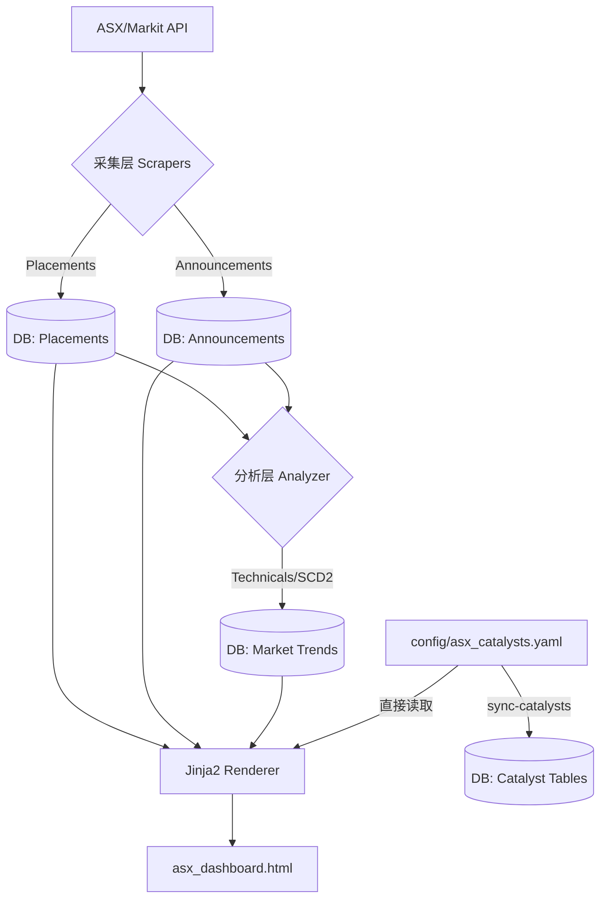

# ASX 投研仪表盘与自动化管线 (ASX Research Dashboard & Automation) `v1.5 - Tech Spec`

这是一个完全解耦的自动化投研数据管线。本文件作为系统的 **唯一事实来源 (Source of Truth)**，详细记录了所有模块的核心逻辑与架构算法，旨在使开发者能够基于此文档重构整个系统。

---

## 🏗️ 1. 全局架构与设计哲学

系统设计核心：**数据源动态化、存储解耦化、UI 静态化**。

### 1.1 数据流向 (Data Flow)


**核心原则**: 
1. `config/asx_catalysts.yaml` 是催化剂数据的唯一源头。
2. **完整性优先**: 运行前强制执行 `pytest` 校验，确保 Model、Schema、UI、Doc 四位一体对齐。
3. **周末智慧跳过**: 周末且数据最新时，自动跳过采集与分析，仅同步配置并渲染 UI。

### 1.2 全解耦存储 (Total Decoupling)
- **无外键约束**: 数据库 `stocks`, `announcements`, `placements` 等表之间不建立物理外键。
- **关联逻辑**: 统一通过 `symbol` (Ticker) 在应用层进行 `JOIN`。
- **目的**: 防止级联删除风险，确保即便主表 Stock 被删除，历史研究快照依然可查。

---

## 🛠️ 2. 模块逻辑解析 (Reconstruction Guide)

### 2.1 基础架构与连接 (`db_manager.py` & `db_models.py`)
- **连接管理**: 使用 SQLAlchemy 的 `scoped_session` 实现线程安全的单例连接池。
- **自动初始化**: `init_db()` 会检查 `asx` schema 是否存在，若不存在则创建 schema 并根据 `db_models.py` 自动反射（Metadata.create_all）所有表定义。
- **事务控制**: 使用 `@contextmanager` 封装 `session_scope`，实现异常自动 Rollback 与资源自动回收。
- **数据验证**: `db_schemas.py` 提供 Pydantic V2 模型用于入库前校验（如 `StockSchema`, `CatalystSchema`, `PlacementSchema`）。

### 2.2 公告采集与评级 (`asx_announcements.py`)
- **增量续传算法**: 
    1. 查询数据库中最新的 `event_date`。
    2. 若存在且未开启 `--full-refresh`，则将抓取起始日设为该日期（Resumption）。
    3. 若不存在，则回退至命令行指定的 `--months`（默认 1 个月）。
- **启发式评分引擎 (Rating Engine 1-5)**:
    - **Base**: 默认 1 分（常规行政/公告）。
    - **+1 分 (API Signal)**: 匹配 API 端的 `isPriceSensitive` 标志。
    - **+3 分 (Strong Phrases)**: 标题/摘要匹配 "high-grade assay results", "maiden resource", "dfs results", "fda approval", "binding agreement" 等核心利好短语。
    - **+2 分 (High Value Keywords)**: 匹配 "assay", "drilling", "high-grade", "discovery", "resource", "acquisition", "merger", "takeover" 等核心关键词。
    - **+1 分 (Mid Value Keywords)**: 匹配 "trading halt", "placement", "quarterly", "guidance", "revenue", "contract", "operational" 等运营词。
    - **特殊逻辑**:
        - **全大写锁定**: 若标题为全大写（且含字母数 > 10），系统视为极其重大突发，强制判定为 **5 分**（如 `NEW BANKING FACILITY`）。
        - **进展封顶 (Progress Cap)**: 标题含 "progress report" 或 "exploration update" 且未触发 Strong Phrases 时，最高封顶 **4 分**。
    - **Summary 逻辑**: 自动从 `announcementTypes` 列表聚合而成（如 "Trading Halt, Market Sensitive"）。
- **公司名解析 (3-Tier Fallback)**:
    1. 优先使用 API 的 `companyInfo.displayName`。
    2. 若 API 为空，则实时匹配本地 `stocks` 表中的 `name` 字段。
    3. 极端情况下回退到 Symbol 原文。
- **Rate Limiting**: API 分页请求之间强制 `time.sleep(0.3)`。
- **时区标准化**: 所有时间戳统一转为 `Australia/Sydney` 时区（通过 `get_sydney_time()`），确保公告日期与交易日一致。
- **证券类型与长度过滤 (Security Type Guard)**:
    - **自动黑名单**: 过滤掉常见的非股票缩写（如 `SPP`, `DIV`, `DRP`, `CR`）。
    - **Issue Type 验证 (严格准入)**: 仅放行 `CS` (普通股)、`CD` (存托凭证)、`ET/UI` (ETF和信托单位)。
    - **防御性拦截**: 如果 API 无法识别 Ticker (返回 400/Symbol Not Found)，系统将拦截该 Ticker 的自动注册，防止“幽灵代码”入库。
    - **Ticker 长度校验**: 强制限制 Ticker 长度 ≤ 4，自动剔除带字母后缀的衍生品。

### 2.3 融资增发监测 (`asx_placements.py`)
- **Filter-First Pipeline（先过滤，后提取）**: 
    1. **Phase 1 - 监控列表门控**: 排除不在 `stocks` 表中的股票。
    2. **Phase 2 - 批量获取市场数据**: 使用 `ThreadPoolExecutor(max_workers=20)` 并行获取合格股票的价格/市值。
    3. **Phase 3 - 流动性门控**: 市值低于 **$15,000,000 AUD** (`DEFAULT_MCAP_FILTER`) 的股票被过滤。
    4. **Phase 4 - CR价格提取**: 仅对通过门控的股票执行标题正则解析→PDF下载→内容提取。
- **正则价格提取 (`extract_cr_price`)**:
    - `pattern_1`: `@ \$?(\d+\.\d+)`
    - `pattern_2`: `at \$?(\d+\.\d+)`
    - `pattern_3`: `\$?(\d+\.\d+) per share`
    - **精度**: 支持最多 4 位小数 (如 $0.7625)。
- **并发刷新与名录回填**: 
    - **自动补全**: 若融资记录缺少 `company` 字段，会在刷新市价时自动从 Markit API 增量提取并回填名称。
- **证券类型过滤 (Security Type Guard)**:
    - 与公告爬虫一致，仅允许 `CS`, `CD`, `ET`, `UI` 类型。
    - 自动拦截市值过低或 Ticker 长度异常的衍生证券。

### 2.4 动能分析与评分 (`asx_analyzer.py`)
- **技术指标定义**:
    *   **RSI (14-Day)**: 使用 **Wilder's Smoothing (维尔德平滑法)** 计算，并抓取 **6 个月** 历史数据以确保算法完全收敛，消除初始值偏差，对齐 TradingView 标准。
    *   **Volume**: 记录最新交易日的成交量（已同步至 DDL）。
    *   **Momentum**: `(当前价 - 周期均价) / 标准差` (Z-Score 变体)。
    *   **Volatility**: 日收益率的标准差百分比。
- **综合权重评分 (Proprietary Score)**:
    - **Base**: 50.0。
    - **修正**: 
        - RSI < 30: +10 分；RSI > 70: -5 分。
        - 动量修正：`momentum * 5`。
        - 价格激增：`1d_diff * 2 + 5d_diff * 1.5`。
        - 成交量激增：`Vol_Change > 50%` 时 +5 分。
    - **Range**: 强制限制在 [0, 100] 区间。

### 2.5 催化剂评级系统
- **数据源**: `config/asx_catalysts.yaml`（唯一源头，人工维护 + Git 版本控制）。
- **Dashboard 读取**: `build_dashboard()` 通过 `load_catalysts_from_yaml()` 直接从 YAML 加载，不经 DB。
- **DB 同步**: `run.py all` 或 `run.py sync-catalysts` 将 YAML 同步到 DB（支持 SCD2 历史追踪）。
- **五级评级**: `强力买入` > `买入` > `观望` > `卖出` > `强力卖出`。
- **自动评级矩阵 (BP × CR)**:
    | Rating | 条件 |
    |--------|------|
    | `强力买入` | 极高 BP + 极低 CR |
    | `买入` | 高 BP + (极低/低/中低) CR，或 极高 BP + 中 CR |
    | `观望` | 中高/中 BP，或 高 BP + 中+ CR |
    | `卖出` / `强力卖出` | 手动降级 |
- **排序优先级**: Rating Score → Breakout Probability → CR Risk → Ticker Name。
- **Dashboard 展示**: 评级以颜色徽章呈现（绿→灰→红渐变）。

### 2.6 缓慢变化维 (SCD Type 2) 逻辑实现
在 `market_trends` 和 `catalyst_items` 中应用：
1. **同步时**: 找出 `symbol` 对应且 `is_active=True` 的记录。
2. **比较**: 若内容发生显著变化，则将旧记录 `is_active` 置为 `False`，设置 `valid_to` 为当前时间。
3. **新增**: 插入新记录，`is_active=True`, `valid_from=Now`。

---

## 💡 3. LLM 协作工作流详解 (`llm_workflow.py`)

系统并非简单的文件覆盖，而是实现了 **Segment-Level Sync (分节同步)**：

- **Export**: 根据 `symbol` 将 `CatalystMaster`（静态属性，含 Rating）与 `CatalystItem`（动态条目）聚合为一个 Pydantic 模型，输出 YAML。
- **Import**:
    - **Master 更新**: 直接更新 `rating`, `cr_risk`, `probability` 及其 `reason` 字段。
    - **Item 智能识别**: 
        - 读取 YAML 中的 `Catalysts`, `Risks`, `Timeline` 数组。
        - 将其与数据库中的内容进行布隆过滤器式的比对。
        - **新条目**: 插入。
        - **消失的条目**: 软删除（退役）。
        - **存在的条目**: 维持现状。

### 3.1 YAML 数据规范 (`config/asx_catalysts.yaml`)

YAML 是催化剂数据的 **唯一事实来源**。Dashboard 直接读取 YAML；DB 通过 `sync-catalysts` 保持同步。

#### 3.1.1 顶层结构

`config/asx_catalysts.yaml` 是一个 **YAML List**，每个元素代表一个 ticker 的研究卡片。

#### 3.1.2 字段格式定义 (Format Definition)

每个 ticker 条目必须为一个 YAML Mapping，字段定义如下（`*` 表示必填）：

| 字段 | 类型 | 说明 |
|------|------|------|
| `Ticker`* | `str` | ASX ticker（不含 `.AX`，会在入库时自动清洗为大写） |
| `Company`* | `str` | 公司全名 |
| `Sector` | `str` | 行业/赛道描述 |
| `Catalysts` | `list[str]` | 未来预期事件/催化剂（通常是未来日期、窗口或里程碑预期） |
| `Risks` | `list[str]` | 风险列表 |
| `CR_Risk`* | `str` | 融资风险等级（建议：`极低/低/中低/中/中高/高`） |
| `CR_Risk_Reason` | `str` | 融资风险原因 |
| `Breakout_Probability`* | `str` | 突破概率（建议：`低/中低/中/中高/高/极高`） |
| `Breakout_Probability_Reason` | `str` | 突破概率原因 |
| `Core_Notes`* | `str` | 核心基本面叙事摘要 |
| `Stage` | `str` | 生命周期阶段：`阶段1-无人关注期/阶段2-验证突破期/阶段3-现金流确认期/阶段4-行业统治期/阶段5-估值溢价期/未分类` |
| `Rating` | `str` | 评级：`强力买入/买入/观望/卖出/强力卖出`（默认 `观望`） |
| `Timeline` | `list[{Date:str, Event:str}]` | 已发生事件（过去公告/确认事件），用于复盘与时间线对齐 |

字段顺序遵循：
`Ticker` → `Stage` → `Company` → `Sector` → `Catalysts` → `Risks` → `CR_Risk` → `CR_Risk_Reason` → `Breakout_Probability` → `Breakout_Probability_Reason` → `Core_Notes` → `Rating` → `Timeline`。

#### 3.1.3 Timeline 规则

- **Timeline 规则**:
    - Timeline 条目 = 已发生的公告，必须有精确 `YYYY-MM-DD` 日期。
    - 模糊日期（如 `2026-03/04`、`2026-04`）不允许，需搜索确认实际公告日期或删除。
    - 未来预期事件属于 `Catalysts`，不放 `Timeline`。
- **Rating 规则**:
    - 默认由 `Breakout_Probability (BP)` 与 `CR_Risk (CR)` 自动推导，若 YAML 显式填写 `Rating`，则以手填值优先。
    - 有效值: `强力买入`, `买入`, `观望`, `卖出`, `强力卖出`。
    - 评分映射：
        - `BP`: `低=0`, `中低=1`, `中=2`, `中高=3`, `高=4`, `极高=5`
        - `CR`: `极低=0`, `低=1`, `中低=2`, `中=3`, `中高=4`, `高=5`
        - `delta = BP_score - CR_score`
    - 默认评级矩阵：
        - `delta >= 4` → `强力买入`
        - `delta >= 2` 且 `< 4` → `买入`
        - `delta >= -1` 且 `< 2` → `观望`
        - `delta >= -3` 且 `< -1` → `卖出`
        - `delta < -3` → `强力卖出`
    - 示例：
        - `BP=高`, `CR=低` → `delta=3` → `买入`
        - `BP=中`, `CR=中` → `delta=-1` → `观望`
        - `BP=低`, `CR=高` → `delta=-5` → `强力卖出`

#### 3.1.4 示例 (Example)

```yaml
- Ticker: TM1
  Company: Terra Metals Limited
  Sector: PGM - Cu - Ni - Ti - V (多金属战略矿产)
  Catalysts:
  - 2026年5月 106 个钻孔的 Assay 结果密集释放窗口
  Risks:
  - 股价波动及市场高杠杆炒作风险
  CR_Risk: 极低
  CR_Risk_Reason: A$85M 资金在场，SOL 作为战略股东
  Breakout_Probability: 极高
  Breakout_Probability_Reason: SW6 块状硫化物物理拦截确认
  Core_Notes: ...
  Rating: 强力买入
  Timeline:
  - Date: '2026-03-18'
    Event: Phase 4 正式启动：5台钻机进场
```

---

## 🧰 4. 辅助工具脚本

| 脚本 | 用途 | 类型 |
|------|------|------|
| `add_stock.py` | 手动添加新股票到 DB 并初始化 CatalystMaster | CLI 工具 |
| `reseed_asx.py` | 从 YAML 完整重建整个 `asx` schema（DROP → CREATE → SEED） | 恢复工具 |
| `sync_asx_catalysts.py` | 增量同步 YAML → DB（SCD2 逻辑，不 DROP 表） | 数据同步 |
| `llm_workflow.py` | LLM 协作导出/导入 (export/import) | 数据同步 |

---

## 📑 5. 数据字典与 ID 生成

- **`unique_key` 生成公式**: `ASXCode_Date_Headline[:100]`。用于保证采集层（Announcements）的幂等性，防止重复插入。
- **`price_history` 存储**: 逗号分隔的字符串（最近 10 次价格），减少 JSONB 膨胀，加速 Sparkline 生成。
- **CR_Price 精度**: Float 类型，支持最多 4 位小数显示。

### 5.1 数据库约束 (CHECK Constraints)

| 表 | 列 | 约束 |
|------|------|------|
| `asx.stocks` | `stock_type` | `IN ('growth', 'foundation', 'etf', 'announcement')` |
| `asx.catalyst_masters` | `rating` | `IN ('强力买入', '买入', '观望', '卖出', '强力卖出')` |
| `asx.catalyst_items` | `item_type` | `IN ('catalyst', 'risk', 'milestone')` |
| `asx.announcements` | `rating` | `BETWEEN 1 AND 5` |

---

### 6.1 环境初始化与完整性校验
```bash
# 1. 复制环境
cp .env.example .env

# 2. 数据库重建 (幂等)
python run.py reseed

# 3. 运行完整性自检 (run.py 会在执行前自动调用)
pytest tests/
```

### 6.2 核心运行逻辑与编排
`run.py` 充当管线指挥官，具备以下高级特性：

1. **🛡️ 完整性检查 (Integrity Guard)**: 在执行 `all` 或 `analyze` 前，强制运行测试套件。若 README 文档滞后或字段不匹配，系统将拒绝执行并报警。
2. **🛌 周末智慧跳过 (Weekend Smart Skip)**: 
   - 自动检测悉尼时间是否为周末。
   - 检查 DB 最新记录是否已达到周五（最新交易日）。
   - 满足条件时跳过抓取与技术分析，仅执行同步与渲染，极大节省计算资源。
3. **🌈 彩色化编排**: 使用 ANSI 颜色方案输出日志，区分各模块状态（Cyan 为路径，Green 为成功，Yellow 为警告，Red 为错误）。

### 6.3 运行命令映射
| 命令 | 用途 |
|------|------|
| `run.py all` | 顺序调用 scrape → analyze → sync-catalysts → build_dashboard |
| `run.py scrape` | 采集公告 + 融资 (`asx_announcements` + `asx_placements`) |
| `run.py analyze` | 技术指标计算 |
| `run.py dashboard` | 仅重建 Dashboard HTML（catalysts 直接读 YAML） |
| `run.py reseed` | 从 YAML 完整重建 `asx` schema (DROP → SEED) |
| `run.py sync-catalysts` | 增量同步 YAML → DB（不 DROP 表） |
| `run.py llm-export --ticker <T>` | 导出指定 ticker 至 YAML 供 LLM 审阅 |
| `run.py llm-import` | 从临时 YAML 导入 LLM 更新至 DB |

### 6.4 版本一致性规范
系统强制执行三位一体版本号 (vX.X) 对齐。版本号必须在以下位置保持一致，否则 Integrity Test 将报错：
- `README.md` (标题)
- `templates/asx_dashboard.html` (Title & Header Pill)
- `tests/test_system_integrity.py` (自动化提取并比对)
- `tests/test_dashboard_fields.py` (跨 Tab 字段命名一致性)

### 6.5 数据完整性规范 (Data Integrity Standards)
为确保投研管线的数据纯净，系统强制执行以下准则：
- **禁止幽灵代码**: 严禁注册 API 无法识别的 Ticker（即 Header API 返回 400/Not Found 的 Ticker）。
- **股票唯一性**: `Placement` 表中的 Ticker 必须在 `Stock` 表中存在，且代码长度不得超过 4 位。
- **自动拦截机制**: 任何非 `CS`, `CD`, `ET`, `UI` 类型的证券在发现阶段即被物理拦截，不得进入数据库任何表。

---

## 🧪 7. 测试与验证规范

修改后必须运行以下测试以确保逻辑闭环 (遵循 **"一脚本一测试"** 原则)：

```bash
pytest tests/ -v
```

| 测试文件 | 覆盖模块 | 关键验证项 |
|----------|----------|------------|
| `test_system_integrity.py` | 全链路 | **版本一致性 (README vs UI)**、DDL 与 Schema 对齐、README 指标更新校验 |
| `test_asx_announcements.py` | `asx_announcements.py` | Rating 启发式、Summary 提取、唯一键幂等性、增量续传、时区感知 |
| `test_asx_placements.py` | `asx_placements.py` | CR价格正则提取、市价同步、名录回填、**Filter-First Pipeline（监控列表/市值门控）** |
| `test_asx_analyzer.py` | `asx_analyzer.py` | 动量评分 (Z-Score) 及评分边界 |
| `test_db_manager.py` | `db_manager.py` | 数据库连接、解耦架构及数据完整性 |
| `test_utils.py` | `utils.py` | 通用工具函数、日期格式化、Sparkline 生成、**Sydney 时区转换** |
| `test_run.py` | `run.py` | 主运行逻辑、Dashboard 渲染、**YAML 直读催化剂排序/默认值**、催化剂字段有效性、Rating Schema 默认值/排序逻辑 |
| `test_dashboard_fields.py` | `asx_dashboard.html` | 跨 Tab 字段命名一致性、标准化字段验证 |

**警告**: 任何对 `db_models.py` 的修改必须运行 `reseed` 校验，并确保 `scripts/db_schemas.py` 同步更新。

---

## 📊 7. Dashboard 字段命名规范 (Field Naming Standards)

为确保跨 Tab 数据展示的一致性，所有表格字段遵循以下命名规范：

### 7.1 标准化字段名

| 标准字段名 | 适用 Tab | 数据字段 | 说明 |
|-----------|---------|---------|------|
| `Ticker` | 全部 | `symbol`, `ASX_Code`, `Ticker` | 股票代码，统一用 `Ticker` |
| `Company` | News, Placements | `name`, `Company` | 公司名称 |
| `Date` | News, Placements | `Date`, `event_date` | 公告/融资日期 |
| `Price` | 全部 | `current_price`, `Current_Price` | 当前股价 |
| `1D %` | Analyzer, News | `price_diff_1d`, `Price_Diff_1d` | 1日涨跌幅 |
| `5D %` | Analyzer | `price_diff_5d` | 5日涨跌幅 |
| `Rating` | News, Catalysts | `Rating` | 评级 1-5 |
| `PDF` | News, Placements | `PDF_Link` | PDF 链接 |
| `Diff %` | Placements | `Price_Diff_%` | 相对 CR 价格涨跌幅 |

### 7.2 字段一致性测试

`tests/test_dashboard_fields.py` 包含以下测试：
- `test_ticker_field_consistency`: 验证 `Ticker` 字段名一致性
- `test_company_field_consistency`: 验证公司名字段一致性
- `test_price_field_consistency`: 验证价格字段一致性
- `test_pdf_field_consistency`: 验证 PDF 字段命名
- `test_no_duplicate_field_names`: 验证无重复字段名

运行测试：`python -m pytest tests/test_dashboard_fields.py -v`
