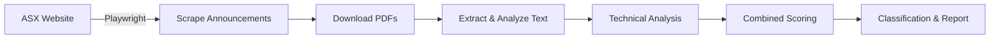

# ASX Announcement Scanner

An automated tool that scans ASX price-sensitive announcements, **reads PDF content**, and classifies stocks as BUY, NEUTRAL, or SELL based on technical and sentiment analysis.

---

## Overview



---

## Quick Start

```bash
# Install dependencies
pip install playwright yfinance pandas numpy pdfplumber requests
playwright install chromium

# Run the scanner
python asx_announcements.py
```

### Command-Line Options

| Flag | Description |
|------|-------------|
| `--visible` | Open browser window for debugging |
| `--all` | Include non-price-sensitive announcements |
| `--no-html` | Skip HTML report generation |
| `--no-pdf` | Skip PDF content analysis (faster) |

---

## How It Works

### 1. Scrape Price-Sensitive Announcements

Navigate to the ASX announcements page and find all **price-sensitive** announcements:
- Extract ASX Code, Headline, Date/Time
- Filter for price-sensitive only (unless `--all` flag used)
- Capture PDF download links

### 2. Download & Read PDF Content

Download each announcement PDF and extract the text content:
- Download PDFs from ASX website
- Extract text using pdfplumber
- Cache PDFs locally for faster re-runs

### 3. Analyse Announcement Sentiment

Analyze each announcement to determine if it's positive or negative:

**Positive Signals:**
| Pattern | Example |
|---------|---------|
| High grade assays | "High-grade gold intercepts" |
| Contract awarded | "$5 million contract signed" |
| FDA/TGA approval | "FDA approval received" |
| Resource upgrade | "Maiden resource estimate" |
| Production started | "Production commenced" |

**Negative Signals:**
| Pattern | Example |
|---------|---------|
| Capital raise | "Capital raising of $10M" |
| Placement | "Placement at $0.05" |
| Rights issue | "Non-renounceable offer" |
| Impairment | "Asset impairment charge" |
| Profit warning | "Guidance reduced" |

### 4. Classification Rules

Stocks are classified based on **Buy Score** vs **Sell Score**:

#### Buy Score (positive signals)

| Factor | Points | Condition |
|--------|--------|-----------|
| Positive keyword in headline | +15 | "high grade", "contract awarded", "FDA approval", etc. |
| Low RSI | +20 | RSI ≤ 40 (room to grow) |
| Neutral RSI | +10 | RSI 41-55 |
| Price consolidated | +15 | 5D change between -5% and +5% |
| Positive trend | +10 | 5D change > 0% |
| Healthy volume | +15 | Volume 1.5x - 3x average |
| Early discovery | +10 | Volume < 1.5x (not yet spiked) |
| Golden cross | +15 | SMA 50 > SMA 200 |

#### Sell Score (negative signals)

| Factor | Points | Condition |
|--------|--------|-----------|
| Negative keyword in headline | +15-25 | "placement", "capital raise", "rights issue" |
| RSI overbought | +15 | RSI > 70 |
| RSI elevated | +10 | RSI 60-70 |
| Pre-announcement run-up | +20 | 5D change > 15% |
| Extreme volume spike | +15 | Volume > 5x average |
| High volatility | +10 | Volatility > 80% |

#### Final Classification

| Rating | Rule |
|--------|------|
| 🟢 **BUY** | Buy score ≥ 20 AND buy > sell |
| 🔴 **SELL** | Sell score ≥ 25 AND sell > buy |
| 🟡 **NEUTRAL** | Neither condition met |

### 5. Rate & Summarize Each Stock

Output a rating and short summary for each stock:
- **Rating**: BUY / NEUTRAL / SELL
- **Summary**: Key points from the announcement
- **Technical Data**: RSI, volume ratio, Today's change, 5D price change

---

## Output

1. **Console**: Color-coded summary grouped by classification
2. **HTML Report**: `asx_announcements_YYYY-MM-DD.html` with **sortable tables** (click headers)

### Filtering

- **Trading Halt** announcements are automatically excluded
- Price-sensitive only by default (use `--all` for all announcements)

---

## Configuration

Edit `config.json`:

```json
{
  "buy_keywords": ["high grade", "discovery", "contract awarded", ...],
  "sell_keywords": ["capital raise", "placement", "rights issue", ...],
  "pdf_analysis": {
    "enabled": true,
    "max_pages": 5,
    "max_workers": 10,
    "cache_pdfs": true
  },
  "analysis": {
    "rsi_overbought": 70,
    "rsi_oversold": 30
  }
}
```

---

## Architecture

```
asx_announcements.py
├── ASXAnnouncementScraper    # Web scraping with Playwright (direct iframe access)
├── PDFAnalyzer               # Download, extract, analyze PDFs
├── StockTrendAnalyzer        # Technical analysis with yfinance (parallel fetching)
├── SellOnNewsDetector        # Buy/sell scoring algorithms
├── ReportGenerator           # Console + HTML output (sortable tables)
└── ASXAnnouncementScanner    # Main orchestrator
```

---

## Files

| File | Description |
|------|-------------|
| `asx_announcements.py` | Main scanner script (~1150 lines) |
| `config.json` | Configuration file |
| `.pdf_cache/` | Cached PDF downloads |
| `asx_announcements_*.html` | Generated HTML reports |
