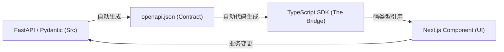

# FastAPI + Next.js: 契约驱动（Contract-Driven）开发模式详解

这种模式通常被称为 **"API-First"** 或 **"Schema-Driven"** 开发。在 FastAPI 和 Next.js 的生态圈中，它是目前最推崇的全栈集成方案。

## 什么是“契约驱动”模式？

它的核心逻辑是以 **OpenAPI (Swagger) 规范** 为核心纽带。后端（FastAPI）定义接口和数据结构，自动生成规范文件；前端通过工具读取该文件，自动生成对应的 TypeScript 类型和 API 请求函数。

### 核心流程 (The Loop)


---

## 为什么要用这种模式？

1.  **100% 类型安全 (Type Safety)**: 前端不需要手写任何 Interface/Type。只要后端改了字段名，前端打包时会立刻报错。
2.  **极速开发**: 节省了大量编写 `fetch` 函数、处理错误、定义参数结构的时间。
3.  **单数据源 (SSOT)**: 只有后端 Pydantic 模型是真实的数据描述，前端永远与后端保持同步。
4.  **自动补全**: 在 VS Code 中键入 `client.` 即可看到所有可用的端点及其参数提示。

---

## 实践：全球大宗商品监控面板

### 第一步：后端模型 (FastAPI)
在 `commodity_dashboard/backend/main.py` 中：

```python
class Commodity(BaseModel):
    ticker: str = Field(..., description="商品代码")
    price: float = Field(..., description="当前价格")
    change_pct: float = Field(..., description="当日涨跌幅 (%)")
    change_abs: float = Field(..., description="当日涨跌绝对值") # <-- 新增字段
    icon: str = Field("Globe", description="Lucide 图标名称") # <-- 新增字段
```

### 第二步：生成 TypeScript 客户端
在前端目录运行：

```bash
npx @hey-api/openapi-ts
```

### 第三步：前端强类型使用
在 Next.js 组件中：

```tsx
// 自动生成的类型和函数
import { type Commodity } from '../api-client';
import { listCommodities } from '../api-client/sdk.gen';

export default async function Dashboard() {
  const { data: commodities } = await listCommodities();
  
  return (
    <div>
      {commodities.map(c => (
        <div key={c.ticker}>
          <Icon name={c.icon} />
          {c.name}: ${c.price} ({c.change_abs})
        </div>
      ))}
    </div>
  );
}
```

---

## 进阶：保持 100% 安全
本项目通过 `sh scripts/generate-client.sh` 将后端最新的 Pydantic 模型全自动同步到前端。如果后端开发删除了 `change_abs` 字段，前端代码在编译阶段（`tsc --noEmit`）就会立刻捕获到这个不匹配，从而防止生产环境崩溃。

## 总结
契约驱动开发将后端模型直接映射到前端类型，彻底消除了联调时的字段名称错误、参数类型不匹配等问题，是现代全栈开发的“黄金标准”。
