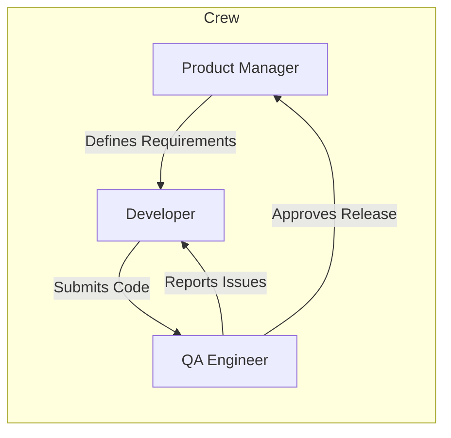
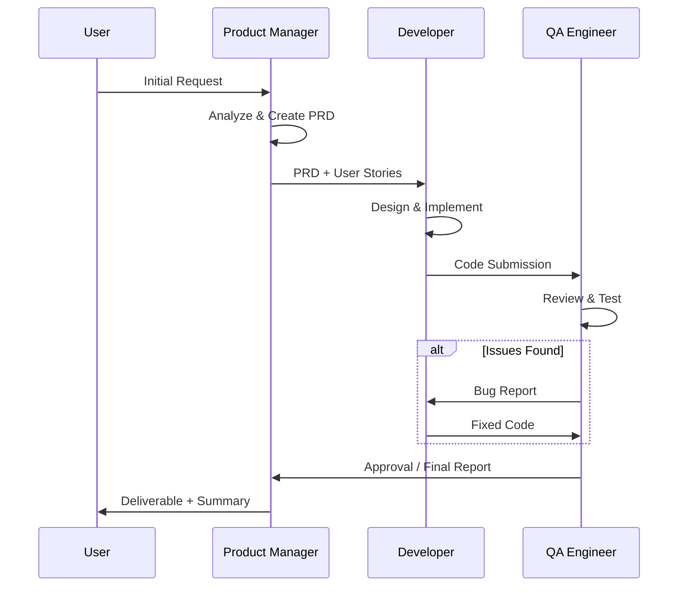

# Multi-Agent Software Development Crew

A CrewAI-based multi-agent system simulating a software development team with a **Product Manager**, **Developer**, and **QA Engineer**.

---

## Overview

This project leverages [CrewAI](https://github.com/joaomdmoura/crewai) to orchestrate three specialized AI agents that collaborate on software development tasks. Each agent has a distinct role, goal, and set of tools, enabling them to work together to produce high-quality software artifacts.

---

## Architecture



---

## Agents

### 1. Product Manager (PM)

| Attribute | Value |
|-----------|-------|
| **Role** | Product Manager |
| **Goal** | Define clear requirements, user stories, and acceptance criteria for the development task. |
| **Backstory** | An experienced product leader who understands user needs and translates them into actionable specifications. |
| **Tools** | `SerperDevTool` (web search), `FileReadTool`, `FileWriterTool` |

**Responsibilities:**
- Analyze the user's initial request.
- Create a Product Requirements Document (PRD).
- Define user stories and acceptance criteria.
- Prioritize features for the development task.

---

### 2. Developer (DEV)

| Attribute | Value |
|-----------|-------|
| **Role** | Senior Software Developer |
| **Goal** | Implement the software solution based on the PM's requirements. |
| **Backstory** | A skilled full-stack developer proficient in multiple programming languages with a focus on clean, maintainable code. |
| **Tools** | `CodeInterpreterTool`, `FileReadTool`, `FileWriterTool`, `DirectoryReadTool` |

**Responsibilities:**
- Review the PRD and acceptance criteria from the PM.
- Design the software architecture.
- Write clean, efficient, and well-documented code.
- Refactor based on QA feedback.

---

### 3. QA Engineer (QA)

| Attribute | Value |
|-----------|-------|
| **Role** | Quality Assurance Engineer |
| **Goal** | Ensure the software meets quality standards and acceptance criteria. |
| **Backstory** | A meticulous tester with expertise in manual and automated testing, dedicated to catching bugs before release. |
| **Tools** | `CodeInterpreterTool`, `FileReadTool`, `DirectoryReadTool` |

**Responsibilities:**
- Review the code produced by the Developer.
- Write and execute test cases.
- Report bugs and issues back to the Developer.
- Approve the final deliverable once all criteria are met.

---

## Task Flow (Sequential Process)



---

## Technology Stack

| Category | Library/Tool | Purpose |
|----------|--------------|---------|
| **Core Framework** | `crewai` | Agent orchestration and task management |
| **Tools** | `crewai-tools` | Pre-built tools for file I/O, web search, code execution |
| **LLM Provider** | `langchain-openai` / `langchain-google-genai` | LLM backend (GPT-4 or Gemini) |
| **Search** | `SerperDevTool` | Web search for research tasks |
| **Environment** | `python-dotenv` | Environment variable management |

---

## Installation

```bash
# Create a virtual environment
python -m venv venv
source venv/bin/activate  # On Windows: venv\Scripts\activate

# Install dependencies
pip install crewai crewai-tools langchain-openai python-dotenv
```

---

## Environment Variables

Create a `.env` file in the project root:

```env
OPENAI_API_KEY=your_openai_api_key
SERPER_API_KEY=your_serper_api_key  # Optional, for web search
```

---

## Project Structure

```
Multi-Agent/
├── README.md           # This file
├── .env                # Environment variables (not committed)
├── main.py             # Entry point - creates and runs the Crew
├── agents/
│   ├── __init__.py
│   ├── product_manager.py
│   ├── developer.py
│   └── qa_engineer.py
├── tasks/
│   ├── __init__.py
│   ├── define_requirements.py
│   ├── implement_code.py
│   └── test_code.py
├── tools/
│   └── custom_tools.py  # (Optional) Custom tools
└── output/              # Generated artifacts (PRD, code, reports)
```

---

## Usage Example

```python
from crewai import Crew, Process
from agents.product_manager import product_manager
from agents.developer import developer
from agents.qa_engineer import qa_engineer
from tasks.define_requirements import define_requirements_task
from tasks.implement_code import implement_code_task
from tasks.test_code import test_code_task

# Create the Crew
dev_crew = Crew(
    agents=[product_manager, developer, qa_engineer],
    tasks=[define_requirements_task, implement_code_task, test_code_task],
    process=Process.sequential,  # Tasks run in order
    verbose=True
)

# Kickoff with a user request
result = dev_crew.kickoff(inputs={
    "user_request": "Build a Python CLI tool that converts CSV files to JSON."
})

print(result)
```

---

## Agent Definitions

### `agents/product_manager.py`

```python
from crewai import Agent
from crewai_tools import SerperDevTool, FileReadTool, FileWriterTool

product_manager = Agent(
    role="Product Manager",
    goal="Define clear, actionable requirements and user stories for the development task.",
    backstory="""You are an experienced product manager who excels at understanding 
    user needs and translating them into detailed specifications. You create PRDs 
    that developers can immediately act upon.""",
    tools=[SerperDevTool(), FileReadTool(), FileWriterTool()],
    verbose=True,
    allow_delegation=False
)
```

### `agents/developer.py`

```python
from crewai import Agent
from crewai_tools import CodeInterpreterTool, FileReadTool, FileWriterTool, DirectoryReadTool

developer = Agent(
    role="Senior Software Developer",
    goal="Implement clean, efficient, and well-documented code based on requirements.",
    backstory="""You are a senior full-stack developer with expertise in Python, 
    JavaScript, and modern software architecture. You write production-ready code 
    with proper error handling and documentation.""",
    tools=[CodeInterpreterTool(), FileReadTool(), FileWriterTool(), DirectoryReadTool()],
    verbose=True,
    allow_delegation=True  # Can delegate back to PM for clarification
)
```

### `agents/qa_engineer.py`

```python
from crewai import Agent
from crewai_tools import CodeInterpreterTool, FileReadTool, DirectoryReadTool

qa_engineer = Agent(
    role="QA Engineer",
    goal="Ensure the delivered software meets all quality standards and acceptance criteria.",
    backstory="""You are a meticulous QA engineer who catches bugs before they 
    reach production. You write comprehensive test cases and provide actionable 
    feedback to developers.""",
    tools=[CodeInterpreterTool(), FileReadTool(), DirectoryReadTool()],
    verbose=True,
    allow_delegation=True  # Can delegate back to Developer for fixes
)
```

---

## Task Definitions

### `tasks/define_requirements.py`

```python
from crewai import Task
from agents.product_manager import product_manager

define_requirements_task = Task(
    description="""
    Analyze the following user request and create a Product Requirements Document (PRD):
    
    User Request: {user_request}
    
    Your PRD should include:
    1. Project Overview
    2. User Stories (with acceptance criteria)
    3. Technical Requirements
    4. Out of Scope items
    5. Success Metrics
    """,
    expected_output="A complete PRD in markdown format saved to output/prd.md",
    agent=product_manager,
    output_file="output/prd.md"
)
```

### `tasks/implement_code.py`

```python
from crewai import Task
from agents.developer import developer

implement_code_task = Task(
    description="""
    Review the PRD created by the Product Manager and implement the solution.
    
    Requirements:
    1. Follow best practices and coding standards.
    2. Include proper error handling.
    3. Add docstrings and comments.
    4. Create a main entry point.
    
    Save your code to the output/ directory.
    """,
    expected_output="Complete, working code files saved to output/",
    agent=developer,
    context=[define_requirements_task]  # Depends on PM's output
)
```

### `tasks/test_code.py`

```python
from crewai import Task
from agents.qa_engineer import qa_engineer

test_code_task = Task(
    description="""
    Review and test the code produced by the Developer.
    
    Your responsibilities:
    1. Read and understand the code.
    2. Check if it meets the acceptance criteria from the PRD.
    3. Execute the code and verify functionality.
    4. Report any bugs or issues.
    5. Provide a final QA report.
    
    If critical issues are found, delegate back to the Developer for fixes.
    """,
    expected_output="A QA report in markdown format saved to output/qa_report.md",
    agent=qa_engineer,
    context=[define_requirements_task, implement_code_task],
    output_file="output/qa_report.md"
)
```

---

## Advanced Configuration

### Using Gemini Instead of OpenAI

```python
from langchain_google_genai import ChatGoogleGenerativeAI

llm = ChatGoogleGenerativeAI(
    model="gemini-1.5-pro",
    google_api_key="your_google_api_key"
)

product_manager = Agent(
    role="Product Manager",
    # ... other config ...
    llm=llm
)
```

### Hierarchical Process (Manager Oversight)

```python
from crewai import Crew, Process

# A "manager" LLM oversees and coordinates agents
dev_crew = Crew(
    agents=[product_manager, developer, qa_engineer],
    tasks=[define_requirements_task, implement_code_task, test_code_task],
    process=Process.hierarchical,
    manager_llm=ChatOpenAI(model="gpt-4o"),
    verbose=True
)
```

---

## Expected Output

After running the crew, the `output/` directory will contain:

| File | Description |
|------|-------------|
| `prd.md` | Product Requirements Document from the PM |
| `*.py` | Implementation files from the Developer |
| `qa_report.md` | Testing report from the QA Engineer |

---

## Next Steps

1. **Implement the agents and tasks** as outlined above.
2. **Add custom tools** if needed (e.g., GitHub integration, database access).
3. **Iterate on prompts** to improve agent output quality.
4. **Add memory** for agents to retain context across sessions.
5. **Integrate with CI/CD** for automated code review pipelines.

---

## References

- [CrewAI Documentation](https://docs.crewai.com/)
- [CrewAI GitHub](https://github.com/joaomdmoura/crewai)
- [CrewAI Tools](https://github.com/joaomdmoura/crewai-tools)
- [LangChain](https://python.langchain.com/)
