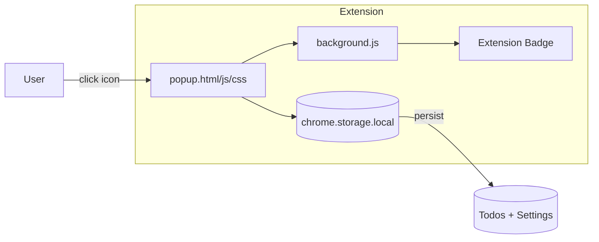

# Solution Design: Chrome Todo Extension

## Overview

A Chrome extension providing a quick-access todo list with priority levels, search/filter, deadlines, and dark mode support.

---

## Architecture



## File Structure

```
chrome-todo-extension/
├── manifest.json      # Extension config (Manifest V3)
├── popup.html         # UI structure
├── popup.css          # Styles (including dark mode)
├── popup.js           # Application logic
├── background.js      # Service worker (badge)
├── docs/
│   ├── PRD.md
│   └── SOLUTION_DESIGN.md
└── icons/
    ├── icon16.png
    ├── icon48.png
    └── icon128.png
```

---

## Data Model

```javascript
// chrome.storage.local
{
  "todos": [
    {
      "id": "abc123",
      "text": "Buy groceries",
      "done": false,
      "deadline": "2026-01-20",   // null if not set
      "priority": "high"           // "high" | "medium" | "low" | null
    }
  ],
  "darkMode": false
}
```

---

## Features

| Feature | Implementation |
|---------|---------------|
| Add Task | Text input + Enter or + button |
| Priority | Dropdown: 🔴 High, 🟡 Medium, 🟢 Low |
| Deadline | Date picker (📅 icon only) |
| Complete | Checkbox toggle → strikethrough |
| Delete | 🗑️ button per task |
| Search | Real-time text filter |
| Filter | All / Active / Completed / Overdue |
| Dark Mode | 🌙 toggle, saves preference |
| Clear Completed | Button when done tasks exist |
| Badge | Shows incomplete count |

---

## Key Functions

| Function | Description |
|----------|-------------|
| `loadTodos()` | Load from storage, render |
| `saveTodos()` | Save to storage, re-render |
| `addTodo()` | Create with text, priority, deadline |
| `toggleTodo(id)` | Toggle done state |
| `deleteTodo(id)` | Remove task |
| `clearCompleted()` | Remove all done tasks |
| `getFilteredTodos()` | Apply search + filter |
| `toggleDarkMode()` | Switch theme, save pref |
| `isOverdue(deadline)` | Check if past due |
| `getPriorityIcon(p)` | Return 🔴🟡🟢 or empty |

---

## UI Layout

```
┌────────────────────────────────────────┐
│ 📋 Quick Todo                      🌙  │
├────────────────────────────────────────┤
│ [Search...          ] [Filter ▼]       │
├────────────────────────────────────────┤
│ [Add task...    ] [⚪▼] [📅] [+]       │
├────────────────────────────────────────┤
│ ☐ 🔴 Buy groceries           📅   🗑️  │
│ ☑    Reply to email               🗑️  │
│ ☐ 🟡 Review PR              ⚠️   🗑️  │
├────────────────────────────────────────┤
│ 2 remaining          [Clear completed] │
└────────────────────────────────────────┘
```

---

## Dark Mode

- Toggle: 🌙 ↔ ☀️ in header
- Saves to `chrome.storage.local`
- CSS class: `body.dark-mode`
- Gradient: `#1a1a2e` → `#16213e`

---

## Verification

1. Add task with priority and deadline
2. Search/filter tasks
3. Toggle dark mode (persists on reload)
4. Complete tasks → Clear completed
5. Check badge updates correctly
