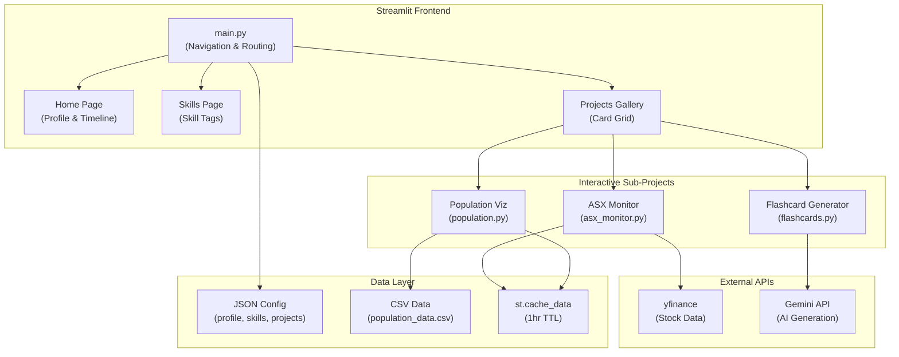

# Streamlit Portfolio Application

A modern, interactive personal portfolio built with Streamlit, showcasing skills, projects, and professional background with integrated interactive demo applications.

---

## Problem Analysis

### Requirements
- **Personal Portfolio**: Display professional profile, skills, experience timeline
- **Project Showcase**: Interactive gallery with live demos
- **Interactive Applications**: Embeddable sub-projects (AI Flashcards, Stock Monitor, Population Viz)
- **Modern UI/UX**: Clean, responsive design with dark/light theme support

### Success Criteria
- Fast page load times with data caching
- Seamless navigation between portfolio sections and interactive demos
- Real-time data fetching for stock monitor
- AI-powered flashcard generation via Gemini API

---

## Architecture Overview



---

## Technology Stack

| Layer | Technology | Justification |
|-------|------------|---------------|
| **Framework** | Streamlit | Rapid Python web app development, built-in widgets, session state management |
| **Data Processing** | Pandas, NumPy | Efficient data manipulation for stock calculations and population analytics |
| **Financial Data** | yfinance | Free, reliable access to ASX stock data |
| **AI/LLM** | Google Gemini 2.5 Flash | High-speed flashcard generation with JSON output mode |
| **Visualization** | Plotly | Interactive animated charts for population timeline |
| **Image Processing** | Pillow | Image resizing and formatting for project thumbnails |
| **Styling** | Custom CSS (Inter font) | Consistent typography and branded aesthetics |

---

## Data Model

### Static Configuration (JSON)

```
data/
├── profile.json     # Name, title, bio, timeline, social links
├── skills.json      # Categorized skill groups
└── projects.json    # Project cards (title, description, category, tags, image, demo link)
```

**Profile Schema:**
```json
{
  "name": "string",
  "title": "string",
  "tagline": "string",
  "bio": "string",
  "timeline": [{"year": "string", "role": "string", "company": "string", "description": "string"}],
  "socials": {"github": "url", "linkedin": "url"}
}
```

**Projects Schema:**
```json
{
  "title": "string",
  "description": "string",
  "category": "string",
  "tags": ["string"],
  "image": "path|url",
  "demo": "internal:<project_name>|<external_url>"
}
```

### Dynamic Data

| Data Source | Format | Caching | Refresh |
|-------------|--------|---------|---------|
| ASX Stock Data | DataFrame (100 stocks × 14 metrics) | `st.cache_data` | 1 hour TTL |
| Population Data | CSV (countries × years 1960-2024) | `st.cache_data` | Static |
| Flashcards | Session State | Per-session | On generation |

---

## Component Structure

```
streamlit/
├── main.py                    # Entry point, navigation, page routing
├── requirements.txt           # Dependencies
├── .streamlit/
│   └── secrets.toml           # API keys (GEMINI_API_KEY)
├── data/
│   ├── profile.json           # User profile data
│   ├── skills.json            # Skills configuration
│   ├── projects.json          # Project gallery metadata
│   └── population_data.csv    # Historical population data
├── images/
│   └── *.png                  # Project thumbnails
└── projects/
    ├── asx_monitor.py         # ASX Stock Monitor logic
    ├── flashcards.py          # AI Flashcard Generator
    └── population.py          # Population animation
```

---

## Key Features

### 1. Home Page
- Hero section with profile photo and tagline
- Professional bio
- Interactive experience timeline with styled cards

### 2. Skills Page
- Categorized skill groups rendered as styled tag badges
- Categories: Cloud Platforms, Data Engineering, AI/LLMs, Architecture, DevOps, Observability

### 3. Project Gallery
- 2-column grid layout with bordered cards
- Category filtering via dropdown
- **Internal demos**: `internal:` prefix triggers `st.session_state.active_project`
- **External demos**: Direct link buttons

### 4. ASX Stock Monitor
- Tracks 100 ASX blue-chip stocks via yfinance
- **Metrics**: Market Cap, Price, P/E, P/S, RSI, Momentum, Volatility
- **Scoring Algorithm**: Custom composite score (0-100) based on weighted factors
- **Concurrent Fetching**: `ThreadPoolExecutor` for 10x parallelism
- **Visual Indicators**: Color-coded gains/losses, RSI overbought/oversold alerts

### 5. AI Flashcard Generator
- Powered by **Gemini 2.5 Flash** with JSON response mode
- Generates 3 question/answer flashcards from user notes
- Flip animation using `st.session_state` toggles
- Native Streamlit widgets (`st.info`/`st.warning`) for distinct card styling

### 6. Population Over Time
- Animated horizontal bar chart (1960-2024)
- Top 15 countries ranked per year
- Auto-play animation via custom JavaScript injection
- Continent-based color coding with legend

---

## State Management

| State Key | Type | Purpose |
|-----------|------|---------|
| `page` | string | Current navigation page (Home/Skills/Projects) |
| `active_project` | string | Currently active sub-project within Projects |
| `flashcards` | list | Generated flashcard data |
| `flip_state_{i}` | bool | Individual flashcard flip state |

---

## Security Considerations

- **API Keys**: Stored in `.streamlit/secrets.toml` (gitignored)
- **Secret Access**: `st.secrets["GEMINI_API_KEY"]`
- **No User Auth**: Portfolio is public (no sensitive user data)
- **External API Calls**: HTTPS only (Gemini API, yfinance)

---

## Running the Application

### Prerequisites
```bash
pip install streamlit yfinance plotly pillow requests pandas numpy
```

### Secrets Configuration
Create `.streamlit/secrets.toml`:
```toml
GEMINI_API_KEY = "your-gemini-api-key"
```

### Launch
```bash
streamlit run main.py
```

---

## Design Aesthetics

| Element | Style |
|---------|-------|
| **Theme** | Dark mode compatible |
| **Font** | Inter (Google Fonts) |
| **Accent Color** | Deep Blue `#0066cc` |
| **Primary Buttons** | Vibrant Green `#28a745` |
| **Cards** | White background, rounded corners, shadow |
| **Timeline** | Blue left-border accent |

---

## Implementation Status

| Component | Status |
|-----------|--------|
| Home Page | ✅ Complete |
| Skills Page | ✅ Complete |
| Project Gallery | ✅ Complete |
| ASX Stock Monitor | ✅ Complete |
| AI Flashcard Generator | ✅ Complete |
| Population Animation | ✅ Complete |

---

## Future Enhancements

- [ ] Add more interactive projects to the gallery
- [ ] Implement dark/light theme toggle
- [ ] Add resume/CV download functionality
- [ ] Integrate contact form with email backend